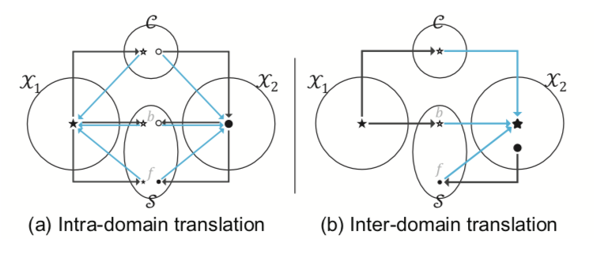
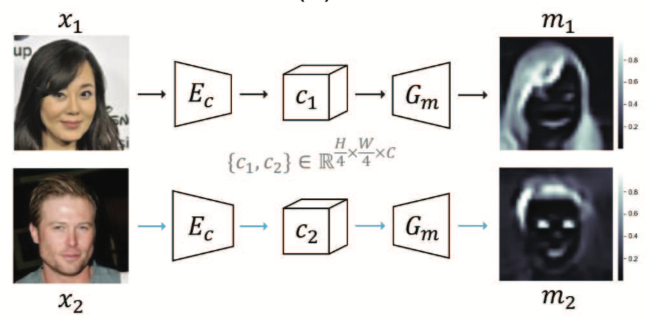
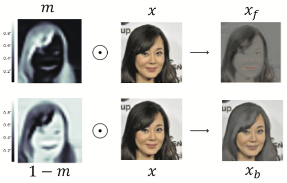
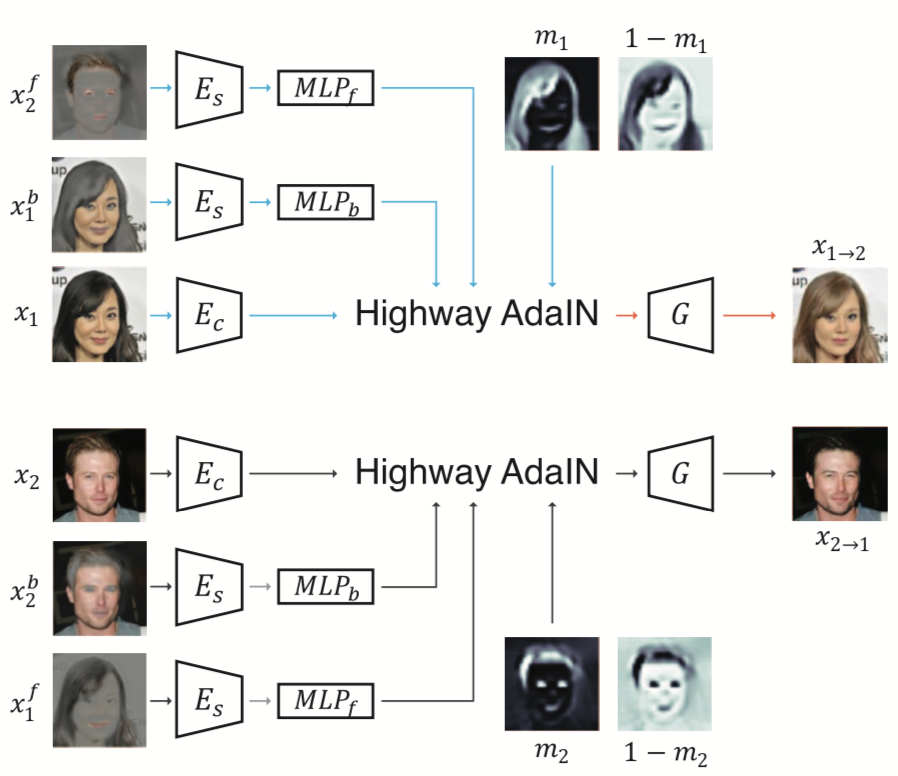
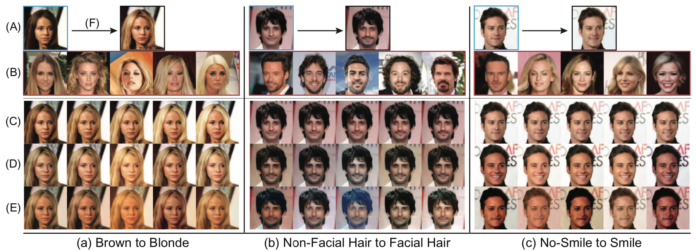
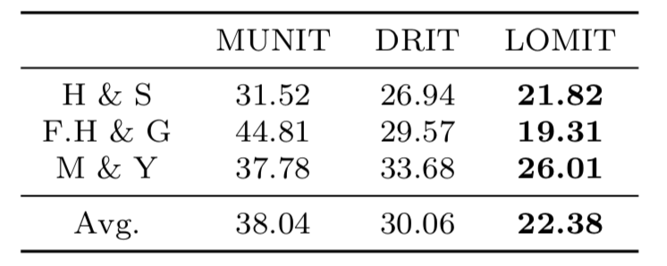
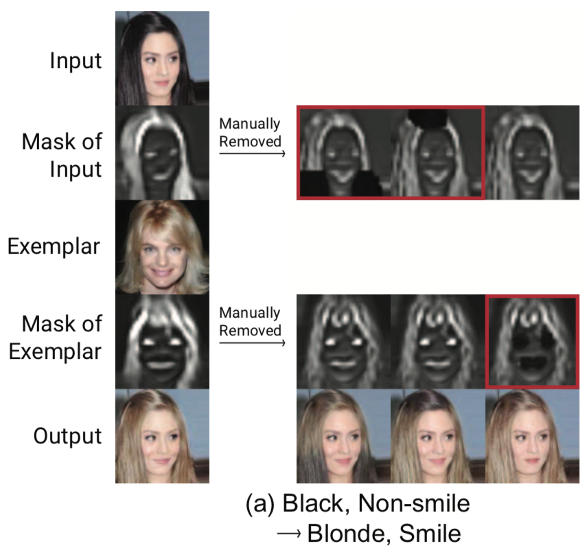

# What and Where to Translate Local Mask-based Image-to-Image Translate

Image-to-Image translation 코딩의 결과 이미지를 보거나 관련 논문의 이미지를 보면 종종 원하지 않는 스타일이 생성 이미지에 들어가는 경우가 많다. 컴퓨터가 보는 이미지는 사람이 보는 이미지와 다르다. 그러므로 바꾸고자 하는 부분이나 목적하는 스타일을 명확하게 컴퓨터에게 알려줘야한다. 그런 고민을 푼 하나의 시도가 해당 [논문](https://arxiv.org/abs/1906.03598v1)이다. 저자는 이전 이미지 변환 과정의 한계점을 (직관적으로)사람이 생각하는 것 처럼 ‘무엇’을 ’어디에’ 적용 할까?라는 고민과 연결시켰다는 점에서 흥미롭게 읽었고 다양한 실험적 결과로 타당성을 탄탄히 했다. 

## 1. Introduction 

### 배경 

GAN을 활용한 분야 중 하나로 Image-to-Image translation의 지속적인 연구가 진행되고있다. 최근 [MUNIT](https://arxiv.org/abs/1804.04732)은 source와 target image를 각각 content와 style domain으로 encoding 시킨 후(이를 disentangle이라고 부르기도 함) 이를 AdaIN을 이용해 target image의 스타일을 입히는 Domain translation을 수행했다. 

### 문제 및 그의 중요성 

흑발의 머리색을 금발의 머리색으로 바꾸는 task가 있다고 가정해보자. 선행 연구를 이용하면 머리 색을 바꿀 수 있지만 바뀌기 원치 않는 스타일(얼굴 색, 화장, 성별 등)도 함께 바뀐다. 본 논문에서는 위의 상황을 두 가지 문제로 구체화하고 있다. (1) exemplar(=target) 이미지의 '어떤' style을 입힐지 구체화 할 수 없다. (2) input 이미지의 '어디에' style을 입힐지 구체화 할 수 없다. 위 두 문제를 잘 푼다면 스타일을 입히는 과정을 좀 더 구체적이며 사용자 친화적으로 바꿀 수 있을 것이다. 

### 논문의 목표 

Exemplar 이미지에서 원하는 스타일을 잘 뽑아내며 동시에 input 이미지에서 원하는 부분에 스타일을 잘 입혀보자. 그 방법으로는 mask-guided 방법을 이용했고 과정에서 새로운 네트워크 구조(LOMIT)을 제안했다. 

## 2. Hypothesis 

Unpaired인 두 이미지 set($X_1$과 $X_2$)은 **content**와 **style**로 구성되며 서로 해당 space를 공유한다. content($C$)는 얼굴 포즈, 눈, 코, 입의 위치, 머리카락의 모양 등 *이미지의 구조*와 관련된 부분이다. 그리고 style($S$)는 이미지 구조의 표현 방법이다. 쉽게말해 배경 색, 피부 톤, 머리 색, 표정 등과 같이 *색칠 정보*라고 생각하면 된다. 

또한 style space는 **foreground style**과 **background style**로 이루어진다. foreground style($s_f$)이란 이동 대상이 되는 style이다(e.g. 머리 색 등). background style($s_b$)은 전체 style에서 foreground 를 제외한 나머지 style이다. 

논문에서는 다음과 같은 수식으로 설명한다. 
- 입력 이미지 $X = C \oplus S$ 
- 스타일 $S = s_f \oplus s_b$ 

결론적으로 input images에서 뽑아낸 content와 background style을 이용해서 그리고 exemplar images에서 뽑아낸 foreground style을 이용해 원하는 목적 이미지를 생성할 수 있다(아래 그림 참조). 

{: width="150" height="100"}{: .center}

* Figure 과정 설명 

    (a) reconstruction 과정으로 각 space로 separate 시키고(검은색 선) 이를 다시 combine 시켜(청록색 선) 원래 이미지를 만들어내도록 학습시킨다. 여기서 LOMIT은 이미지의 encoding과 decoding 과정을 학습한다. 
    
    (b) cross domain translate 과정 중 $X_1 → X_2$ task를 보여준다. 
    - Encoding(검은색 선) : $X_1$으로 부터 기본 구조인 content와 바꾸고 싶지 않은 스타일인 background style을 encoding시키며, $X_2$로부터 바꾸고 싶은 스타일 foreground style을 encoding 시틴다. 
    - Decoding(청록색 선) : encoding된 3개의 code를 합친다. 결과적으로 input image에 원하는 부분만 exemplar의 style이 추가된 이미지 생성한다. 

## 3. Network Architecture

* 목적 : Exemplar의 foreground style을 input의 content와 background style에 입혀보자! 
* 입력 : 각 도메인(input & exemplar)의 이미지 
* 출력 : 목적을 만족시키는 이미지 
* 구성 network 
    1. Local Mask Extraction
    2. Mask Guided Generator

### 3-1. Local Mask Extraction 

{: width="150" height="100"}{: .center}

* 목적 : ‘이 부분은 foreground이고, 저 부분은 아니야(background야)!’ 라고 알려주는 mask를 생성하며, mask가 갖고있는 의미는 각 pixel이 어느정도 foreground와 관련 있는지를 나타내는 비율이다.
* 입력 : 각 도메인(input & exemplar)의 이미지 
* 출력 
    - 각 도메인에서 foreground에 해당하는 부분이 표시된 mask
    - pixel-wise soft binary(0~1의 값을 갖음) tensor.
    - mask의 크기 : 입력 이미지와 같은 width, height를 갖으며 channel은 1이다.
* 구체적 특징 :
    - Auto Encoder 구조를 갖음 
    - 논문에서는 Attention network라고 표현
    - 각 도메인에 독립적으로 사용
    - Encoding network의 결과($c_i$)로 원본 이미지의 1/4 크기의 width, height를 갖고 channel 크기는 같은 tensor가 나온다.

#### local foreground & background region 
{: width="150" height="100"}{: .center}

원본 이미지들은 foreground와 background style들이 섞여 있기 때문에, 각 스타일만이 살아있는 이미지를 local region이라고 표현했다. 원본 이미지와 구한 mask 이미지를 element-wise multiplication 과정을 통해 구할 수 있다. 즉 위 그림처럼 mask $m$에 원본 이미지 $x$를 곱함으로써 foreground style만 살아있는 이미지($x_f$)를 얻고 $1-m$을 이용해 background style만 살아있는 이미지($x_b$)를 얻을 수 있다. 

- $x_f = m \odot x$
- $x_b = (1-m) \odot x$

### 3-2. Mask Guided Generator
{: width="150" height="100"}{: .center}

* 목적 : input 이미지와 앞선 네트워크의 결과물들(mask와 local region)을 잘 조합해보자
* 입력 : 
    - input 이미지 ($x_i$)
    - background style이 살아있는 *input* 이미지 ($x^b_i$)
    - foreground style이 살아있는 *exemplar* 이미지 ($x^f_e$)
    - mask 이미지와 inverse mask이미지 ($m_i$와 $1-m_i$)
* 출력 : 
    - input 이미지의 content와 background style과 exemplar 이미지의 foreground style이 합쳐진 이미지 ($x_{i→e}$)
* 구체적인 특징 : 
    - Ec : mask extraction 과정에서 사용한 encoder와 동일, 입력 이미지에서 content code를 뽑아줌 
    - Es : 입력 이미지에서 style code를 뽑아줌
    - Highway AdaIN : 논문에서 제시하는 새로운 구조로 구체적인 사항은 아래 설명 
    - G : HAdaIN의 결과물을 실제 이미지로 만들어줌

#### Highway AdaIN(HAdaIN) 

* 기본적인 AdaIN은 [여기](https://arxiv.org/abs/1703.06868)에 그리고 이를 image translation 과정에 접목시킨 대표적인 논문인 MUNIT은 [여기](https://arxiv.org/abs/1804.04732)에서 참고 가능하다. 앞서 설명한 바와 마찬가지로 MUNIT의 방법은 이미지의 전체 부분을 변환시킨다. 그러므로 스타일 변화를 원치 않는 부분에서 불필요한 변형(distortion)이 생긴다.

$$
HAdaIN_{x_1→x_2}(m_1, c_1, s^f_2, s^b_1) = m_1 ⦿ AdaIN_{x_1→x_2}(c_1,s^f_2) + (1-m_1) ⦿ AdaIN_{x_1→x_1}(c_1,s^b_1)
$$

* 좌변 : $x_1→x_2$를 위한 task로 input 이미지의 mask와 content 및 local background region 그리고 exemplar 이미지의 local foreground region이 필요하다. 

* 우변의 첫 번째 term 
    - Content code($c_1$)에 style을 채우기위해 AdaIN을 사용한다. 이때 중요한점은 첫 term은 foreground style을 채우는 부분이므로 exemplar 에서 추출한 $s^f_2$를 사용한다. 
    - 입힌 style 정보는 foreground에만 해당하는 (pixel의)정보이므로 mask를 곱해서 background pixel에 해당하는 값은 죽여(?)준다.

* 우변의 두 번째 term 
    - 위와 마찬가지로 AdaIN을 이용해 style을 채우는 부분인데, 주의해서 봐야할 부분은 input content에 input style을 채우는 부분이라 AdaIN의 목표가 $x_1→x_1$ 라는 점이다. 
    - 마찬가지로 ($1-m_1$)를 곱해줘서 background pixel의 정보만 살려둔다. 

## 4. Loss Functions 

### 4-1. Style Reconstruction Loss 
$$
L^{1→2}_{s_f}=E_{x^f_{1→2}, x^f_2}[||E_s(x^f_{1→2})-E_s(x^f_2)||_1]
$$

변환된 이미지의 foreground이미지($x^f_{1→2}$)의 style($E_s(.)$)과 exemplar이미지의 foreground이미지($x^f_2$)의 style($E_s(.)$)은 비슷해야 하며 이 비슷함의 정도는 L1 Loss를 사용한다. 

$$
L^{1→2}_{s_b}=E_{x^b_{1→2}, x^b_1}[||E_s(x^b_{1→2})-E_s(x^b_1)||_1]
$$

위와 마찬가지로 background에 대해서 적용한다. 

### 4-2. Content Reconstruction Loss 
$$
L^{1→2}_c=E_{x_{1→2}, x_1}[||E_c(x_{1→2})-E_c(x_1)||_1]
$$

변환 이미지의 content code($E_c(x_{1→2})$)는 input 이미지의 content code($E_c(x_1)$)과 비슷하게 유지돼야 하며 비슷함의 정도는 L1 Loss를 사용한다.

### 4-3. Image Reconstruction Loss 
* Cycle consistency loss

$$
L^{1→2→1}_{cyc} = E_{x_1}[||x_{1→2→1}-x_1||_1]
$$

$x_1 → x_2 → x_1$ 혹은 그 역의 방향으로 cycle consistency loss적용 하며 L1 Loss 사용한다.

* Intra-domain translation loss 

$$
L^{1→1}_{x} = E_{x_1}[||x_{1→1}-x_1||_1]
$$

$x_1 → x_1$ 으로 원래 이미지 복원 유지력도 부여하며 마찬가지로 L1 Loss 사용한다.

### 4-4. Domain Adversarial Loss 
[WGAN-GP](https://arxiv.org/abs/1704.00028)과 [patchGAN](https://arxiv.org/abs/1611.07004)을 사용해보았으며 두 경우 중 WGAN-GP가 실험적으로 가장 좋은 이미지를 생성했다고 한다.

* Discriminator network ($D_{src}$)

$$
L^{1→2}_{adv} = E_{x_1}[D_{src}(x_1)]-E_{x_{1→2}}[D_{src}(x_{1→2})]-\lambda_{gp}E_{\hat{x}}[(||\triangledown_{\hat{x}}D_{src}(\hat{x})||_2-1)^2]
$$

우변의 앞 두 term : 보통은 생성 이미지와 target 이미지와 비슷하길 바라는 목적으로 목적 함수를 설계하지만 여기서는 생성 이미지와 input 이미지를 이용해 목적 함수를 설계했다. Examplar 이미지는 특정한 스타일만 가지고 와서 input 이미지에 덮어 씌우므로 비교 대상이 $x_1$과 $x_{1→2}$가 되도록 설계한듯 하다.
만약 $x_2$와 $x_{1→2}$를 이용해 설계했다면 생성 이미지는 examplar 이미지의 target style뿐 아니라 다른 요소들까지 비슷하게 만들려고 노력했을 것이다.

우변의 마지막 term : Gradient panalty term이다. 원 논문을 참조! 

### 4-5. Multi-Attribute Translation Loss 

만약 흑발을 금발로 바꾸는 task를 진행한다고 하면, 원래 이미지와 생성 이미지에 label을 매길 수 있다. 원본 이미지는 0(흑발), 생성 이미지는 1(금발) 이런식으로… 만약 label을 예측하는 모델이 있다면 이 모델은 원래 이미지와 생성 이미지에서 더 눈여겨 봐야하는 부분(예를들어 머리 카락의 색 등)에 더 초점을 맞출것이다. - 마치 틀린그림 찾기 처럼 - 

해당 논문에서는 그렇게 classify 하는 모델($D_{cls}$)이 $D_{src}$와 parameter sharing을 함으로서 $D_{src}$의 학습을 돕는 보조 네트워크를 사용 했다. 이러한 과정은 $D_{src}$가 $x_1$과 $x_{1→2}$를 더욱 잘 구분할 수 있도록, 나아가 정확히 mask를 씌워야 하는 부분을 찾을 수 있도록 가이드 역할을 할 것이다. 

$$
L^{1→2}_{cls_r} = E_{x_1}[-logD_{cls}(y_{x_1}|x_1)]
$$
$$
L^{1→2}_{cls_f} = E_{x_{1→2}}[-logD_{cls}(y_{x_2}|x_{1→2})]
$$

$D_{cls}(y_{x_i}|x_j)$ : $x_i$이미지가 주어질 때, 그 이미지의 label($y_i$)를 예측하는 확률

Label을 매기는 방법은 정확히 언급하지 않았으나 실험 과정에서 CelebA dataset을 사용하며 특정 10개의 attribute를 선택했다고 나와있다. 좀 더 자세한 방법은 선행연구인 [starGAN](https://arxiv.org/abs/1711.09020) 참고하면 된다. 

### 4-6. Mask Regularization Losses

논문의 핵심 역할을 하는 mask를 잘 구하기위해 2가지 regularization을 적용했다. 이들은 비슷한 영역(e.g., 머리카락 끼리)은 1(에 가까운) 값으로, 그렇지 않은 영역은 0(에 가까운) 값으로 만들기 위한 목적을 갖고있다.

* 첫 번째 Regularization 

목적 : 다양한 exemplar 이미지의 다양한 환경(각도, 빛의 세기 등)에서도 비슷한 의미를 갖는 영역은 같은 mask value를 갖어야 한다.

$$
R_1=E[\sum_{i,j}[|(m \cdot 1^T)-(1 \cdot m^T)|\odot(\hat{c} \cdot \hat{c}^T)]_{i,j}]
$$

$(m \cdot 1^T)$ : WH x WH의 크기로 행은 모두 같은 값이고 열은 각 픽셀에 해당하는 값을 일렬로 나열한 matrix. 

좌측 term : 각 픽셀끼리 mask value값의 절대값 차이를 나타내는 symmetric 행렬

$\hat{c}$ : 이미지의 채널(R,G,B)마다 각 채널 안에서 값들을 normalize한 matrix 

우측 term : 각 채널 안에서 각 픽셀끼리의 cosine similarity

최종적으로 거리가 멀지 않은 구역에서 비슷한 RGB값을 갖는 pixel은 비슷한 mask value를 갖도록 강제하는 object function이다. Back propagate 과정에서는 attention network 만 update 수행했다고 한다. 

* 두 번째 Regularization
$$
R_2 = E||m||_1
$$

각 mask($m_1$, $m_2$)에 대해 L1 regularization을 수행한다. 비슷하지 않다고 판단된 mask value를 더욱 0에 가깝도록 강제한다. 

---

### Object function들의 역할 

* Image reconstruction loss : 생성 이미지의 픽셀과 input 이미지의 픽셀이 같은 값을 갖도록!

* Style reconstruction loss : exemplar 이미지의 style code가 스타일이 입혀진 input 이미지의 style code에서도 유지가 되도록!

* Adversarial loss : 실제 이미지와 생성 이미지의 분포 사이의 거리를 줄이도록!

* Multi-attribute translation loss : 목적에 맞게 생성된 이미지가 목적에 맞게 분류되도록! (e.g. 생성한 금발 이미지가 금발로 분류 되도록)

---
## 5. Experiments 

논문에서는 다양한 Dataset에대해 비교 이미지를 비롯한 양적, 질적 결과와 Ablation study의 실험 결과가 있다. 이번 포스트에서는 모든 경우를 다루지 않고 제일 많이 쓰이는 CelebA의 결과만 포스트 할 생각이고 다른 결과는 필요하면 찾아보면 좋을 것 같다. 

### 5-1. Settings 
#### 5-1-1. Dataset 
* CelebA 
    * 약 20만개의 이미지 (train : 약 19만개, test : 1만개)
    * 40개의 attribute 중 10개의 attribute 만 사용 
    * center cropped & resize to 128x128 
* EmotioNet 
    * 총 97.5만개 이미지 중 일부 사용 (train : 20만개, test : 1만개)
    * 12개의 action unit(어떤 근육을 사용하는가)를 label처럼 사용 
    * face detector로 cropping & resize 128x128 
* Wild image dataset 
    * zebra2horse, apple2orange 사용 
    * CelebA와 EmotioNet보다 더욱 많은 intra-domain variation 
    * 같은 도메인이라도 그 안에서 갖는 variation이 더 큼
        * 같은 object라 할지라도 이미지에 나오는 object의 수나 위치 등이 다양

#### 5-1-2. Baseline Methods
* [MUNIT](https://arxiv.org/abs/1804.04732), [DRIT](https://arxiv.org/abs/1808.00948)
    * CelebA data를 이용한 face image translation 비교 과정에서 사용 
* [AGGAN](https://arxiv.org/abs/1806.02311)
    * wild image data를 이용한 비교 과정에서 사용 
    * SOTA in mask-based image translation
* [ELEGANT](https://arxiv.org/abs/1803.10562)
    * CelebA data를 이용한 비교 과정에서 사용

#### 5-1-3. Metrics
* FID 
* Mean Reciprocal Rank(MRR) 
    * User study, Human evaluation 
    * 전체 질문에 대해 특정 모델의 등수의 역(inverse) 
    * 0~1 사이의 값으로 높은 값이 좋은 성능을 의미 

### 5-2. CelebA dataset 

{: width="150" height="100"}{: .center}

(A) : Input 이미지 / (B) : 각 column의 결과를 내기위해 사용된 exemplar 이미지 / (C) : LOMIT / (D) : DRIT / (E) : MUNIT / (F) StarGAN

(D)와 (E)의 경우 다른 exemplar를 사용함에 따라 나타나는 외부 배경 색을 비롯한 피부 색, 표정 등에서 미묘한 왜곡(distortion)을 볼 수 있다. 하지만 논문에서 제시하는 LOMIT(C)는 목적 task(머리 색 바꾸기와 웃는 얼굴로 바꾸기)는 물론 위에 말한 문제가 보이지 않는다. 

{: width="150" height="100"}{: .center}

위 그림은 FID score를 이용한 평가로 distance 수치로 낮은수록 좋다. 특정 attribute로 생성된 이미지의 subset을 만들고 이에대한 score를 계산했지만, 결과적으로 Avg의 값이 제일 낮은것으로 보아 다른 method보다 좋다고 얘기하고 있다. 

### 5-3. User Intervention 
Mask를 이용해 '입힐 스타일'을 선택하고 그것을 '입힐 위치'를 선택하는 방식이므로 사용자가 생성된 Mask를 변경함에따라 생성 결과 이미지가 달라지는 실험을 진행했다. 

{: width="150" height="100"}{: .center}

좌측의 output이 사용자 관여가 없는 결과 이미지이다. 사용자 임의로 변경한 Input과 exemplar의 mask들은 빨간색 box가 씌워져있다. 변경된 mask를 사용해 이미지를 생성한다면, 임의로 지운 부분은 스타일이 입혀지지 않은 모습을 살펴볼 수 있다. 

## 6. Conclusion 

Unpaired image-to-image translation 환경에서 mask를 이용해 '어떤 스타일을 어디에 입힐지'라는 문제를 해결하려 고민한 논문이다. Exemplar 이미지의 mask는 변환할 스타일을 골라내는, input 이미지의 mask는 스타일을 입힐 위치를 골라내는 방식으로 작동한다. 기존 방법들보다 왜곡(distortion) 없이 특정 스타일만 잘 골라 입혀냈음을 다양한 실험적 과정을 통해 보여주었다. 
