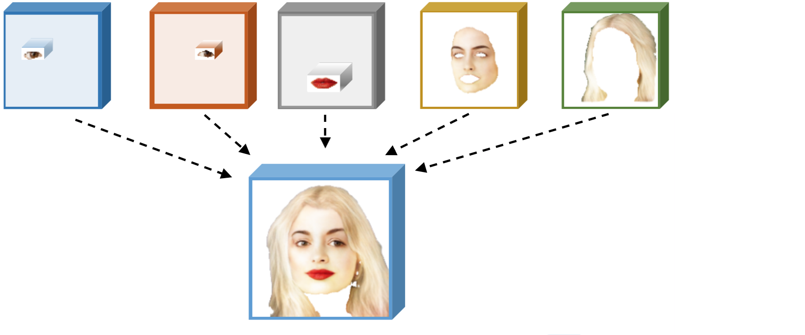
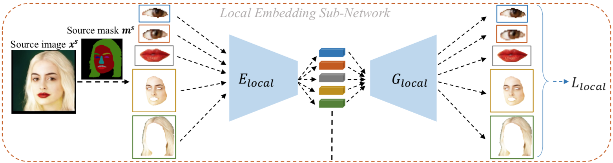
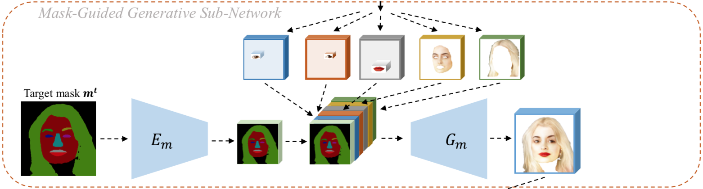
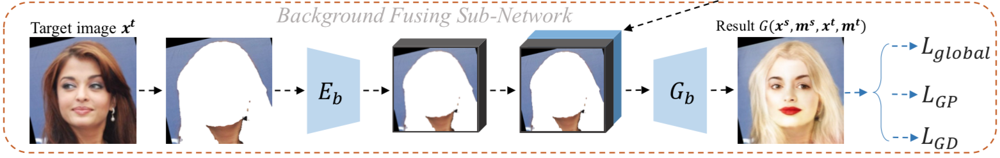

화가 혹은 이미지 작가들이 사람 얼굴을 그릴 때 눈, 코, 입 등을 동시에 완성하기보다는 각 요소들을 따로따로 그리고 마지막에 전체적으로 이들이 잘 어울리도록 리터칭 하는 영상을 본 적 있다. 이 [논문](https://arxiv.org/abs/1905.10346)은 마치 이런 사람의 수행 방식을 네트워크로 옮기는 고민을 한 듯하다. 이 사람(target) 얼굴의 눈을 저 사람 얼굴(source)의 눈으로 바꾸고 다른 부위도 마찬가지로... 단순한 아이디어이지만 이를 네트워크로 녹여내는 과정을 유심히 보게 되었다. 

## 1. Introduction 

### 배경 

Portrait editing은 Snapchat 같은 앱 및 여러 분야에서 인기가 있고 이 분야에서 GAN을 이용해 실사형 얼굴을 생성하거나, 얼굴의 특징(attribute)을 바꾸는 연구들이 많이 진행되고 있다. 대표적으로 mask를 이용한 [pix2pix](https://arxiv.org/abs/1611.07004)와 [pix2pixHD](https://arxiv.org/abs/1711.11585)이 있다. 또한 하나의 mask로부터 다양한 결과 이미지를 얻을 수 있는 [BicycleGAN](https://arxiv.org/abs/1711.11586)이 있다.

### 문제 및 그의 중요성 

전통적인 컴퓨터 비전과 GAN을 이용해 mask를 사용하는 방법들은 좋은 geometric constraint를 줄 수 있지만 <U>세부적인 요소(눈, 코, 입 등)들을 위한 constraint를 주기 힘들다</U>. 또한 목적 자체가 시각적 스타일 변환(e.g. black ↔ ︎white, painting 등)을 잘 하는 것이다. 그리고 multi-modal을 위한 방법으로 BicycleGAN을 소개했지만 이 방법에서 소개하는 다양성이란 색깔에 국한된다. 

### 논문의 목표 

해당 논문에서는 세부적 요소 기준으로 editing 할 수 있는 GAN 구조를 제시하고 있다. 더불어 이를 diversity, quality, controllability 관점에서 기여하고 있다고 설명한다.

## 2. Basic Idea 

보편적인 Image translation 방법은 한쪽 domain의 전반적인 스타일을 학습하고 이를 다른 domain에 입히는 방식이다. 하지만 이 논문에서는 전체적인 특성보다는 **부분적인 component들 각각의 특성을 학습하고 이를 잘 조합하는 방식**으로 portrait editing task를 수행하려 한다. 예를 들어 눈은 눈대로 잘 만들고, 입은 입대로, 얼굴 형태도 그것대로, 머리카락 역시 머리카락대로 만들고 이후에 이를 조합하는 방식으로!  

{: width="400" height="150"}{: .center-image}

특정 component를 embedding 하고 이를 다시 잘 재조합하는 컨셉이 image to image translation 과정에 바로 적용되기는 힘들어 보인다. (source과 target의 content가 많이 다른 과정에는 적용을 어떻게 하지??) 하지만 그만큼 조건이 만족된다면 그 task에는 강력하다고 생각된다. 

### Non-Parmaetric image synthesis

이것은 이미지를 적당한 patch로 나눠 각 patch를 비교하면서 warping과 stitching을 이용해 목적 이미지를 생성하는 방법을 말한다. 이 논문에서 제시하는 방식은 non-parametric 방법과는 다르다고 강조한다. 즉, 얼굴의 각 요소(눈, 입 등)마다 encoding과 decoding 과정을 거치는 것이지 이를 patch 형식으로 나눠 처리하는 것이 아니다. 
 
## 3. Network Architecture

* 목적 : Target 이미지를 source 이미지의 모습처럼(눈, 코, 입, 얼굴 형태, 머리카락) 바꿔보자 
* 입력 : Source와 target 이미지
* 출력 : 목적을 만족시키는 이미지 
* 구성 network 
    0. Pretrain : Face Parsing Network
    1. Local Embedding Sub-Network
    2. Mask-Guided Generative Sub-Network
    3. Background Fusing Sub-Network 

조금 이른 비판(?)을 하자면 결과 이미지는 source 이미지에서 눈, 코, 입, 얼굴, 머리카락을 떼고 이것들을 target 이미지에 붙여 넣은듯한 이미지이다. 실제로 논문의 figure 2에서 결과 이미지의 눈동자 방향은 source 이미지의 눈동자 방향을 따른다. 

### 3-0. Face Parsing Network

* 목적 : 이미지의 mask를 생성 
* 입력 : Source 혹은 target 이미지
* 출력 : 입력 이미지에 해당하는 mask 이미지 

이 부분은 실제 학습을 하는 네트워크의 일부인데 논문에서 자세한 설명으로 다루고 있지 않다. $P_F$라고 표현하고 신기하게도 loss 파트에서 설명을 한다. U-Net 네트워크를 가지며 [Helen Face Dataset](https://www.cv-foundation.org/openaccess/content_cvpr_2013/papers/Smith_Exemplar-Based_Face_Parsing_2013_CVPR_paper.pdf)을 이용했다고만 설명되어있다. 

### 3-1. Local Embedding Sub-Network 

{: width="640" height="180"}{: .center-image}

* 목적 : Source 이미지에서 5가지 얼굴의 요소를 뽑아내고 이를 인코딩 시킴
* 입력 : Source 이미지($x^s$, 256x256)와 이에 해당하는 mask($m^s$, 256x256)
* 출력 : 5 요소들의 인코딩 결과 tensor(height, width, channel의 구체적인 값은 제시하지 않음)

* 구체적 특징 
    - 명확히 말하면 위 그림에서 $E_{local}$이라는 부분이 Local Embedding sub-network 임(그 관점에서 보면 입력이 달라질 수 있음)
    - $G_{local}$은 디코더로 loss 계산을 위해 사용되는 네트워크
    - 그림은 하나만 그렸지만 실제로 각 요소에 해당해서 하나씩의 $E_{local}$을 갖고 있고 그러므로 총 5개의 네트워크가 있음
    - 각 요소들은 사람마다 그 크기가 다를 것이므로 원본 이미지에서 추출 후 통일된 사이즈로 resizing 시킨다. (눈 2개 : 48x32, 입 : 144x80, 얼굴 : 256x256, 머리카락 : 256x256)

### 3-2. Mask-Guided Generative Sub-Network
{: width="640" height="180"}{: .center-image}

* 목적 : Target 이미지 mask를 바탕으로 5개의 인코딩들을 잘 조합해보자 
* 입력 : 
    - target 이미지의 mask($m_t$)
    - local embedding sub-network의 결과물인 5개의 인코딩 결과물 
* 출력 : 
    - target mask의 눈 코 입 얼굴 머리카락 위치에 알맞게 인코딩들이 배치가 된 tensor
* 구체적인 특징 : 
    - $E_m$ : target mask를 특정한 값의 height, width를 갖도록 인코딩 시키는 네트워크, 이 height와 width는 위에서 언급한 인코딩 값들과는 다르고 아래서 다시 사용됨
    - 총 6개의 인코딩 결과값을 묶는 방법은 단순 concat!
    - $G_m$ : concat된 뚱뚱한 tensor를 묶어 또 다른 tensor로 mapping 시켜주는 네트워크 

* 주의할 부분
아마도 저자는 이해를 돕기 위해 위 그림을 그리면서 인코딩 결과물에 인코딩 전의 입력 이미지를 그려 넣은듯하다. 하지만 실제로는 인코딩을 앞에서 봤을 때 저렇게 보이지 않을 것임을 주의해야 한다. 

* Concat 설명 추가 
    - $E_m$의 결과물의 height와 width 그리고 $E_local$의 결과물의 channel을 갖는 0 tensor를 준비
    - 이 tensor에 인코딩 한 5개의 요소들을 배치할 건데, 그 위치는 target mask의 인코딩 결과물의 각 요소 위치에 맞춤 (왼쪽 눈 자리에 왼쪽 눈을, 입 위치에 입을 ...)
    - 의문점 : 위에서 주의할 부분에서 언급한 것처럼 인코딩 결과는 이미지가 아닌데, <U>각 위치를 어떻게 알 수 있는지...??</U> 아마 추측되는 부분은 원래 target mask의 크기와 인코딩 된 결과물의 height와 width 압축 비율을 바탕으로 해당 위치를 예측하는 방법이 아닐까 싶다. 
    - ex) target mask 크기 : (100, 100) / 왼쪽 눈 위치 : (10,10) / 인코딩 map의 크기 : (50, 50) 이라면 (5,5)위치에 위치 시킬 수 있음.

### 3-3. Background Fusing Sub-Network
{: width="640" height="150"}{: .center-image}

* 목적 : 생성된 합성 얼굴 이미지에 target 이미지의 배경(target 이미지의 목도 포함하는)을 입히기 

* 입력 : 
    - target 이미지($x^t$)
    - 얼굴 합성된 이미지(이전 네트워크의 결과물)

* 출력 : 
    - 배경까지 입혀진 최종 결과물 

* 구체적인 특징 : 
    - Target 이미지와 mask를 이용해서 얼굴과 머리카락 부분을 제외한 나머지 부분을 추출함 
    - $E_b$ : 배경만 남은 이미지를 입력으로 받고 이를 인코딩 시킬 인코딩 네트워크임. 결과물의 크기는 (concat이 가능하도록) 이전 네트워크의 height와 width와 동일 
    - $G_b$ : 최종 디코딩 네트워크로 배경과 얼굴 부분 인코딩 결과물들을 입력으로 받아 최종 결과물을 만들어 냄
    
## 4. Loss Functions 

학습 시 두 상황을 고려한다. (1) source 이미지와 target 이미지가 같은 경우(paired data), (2) source 이미지와 target 이미지가 다른 경우(unpaired data). 실제로 (1)의 경우는 결과 이미지나 입력으로 주는 두 개의 이미지가 모두 같아야 한다. 학습에 사용한 데이터는 20,000개이므로 Paired data 와 unpaired data의 비율은 대략 1:20,000 정도로 생각된다. 

### 4-0. Face Parsing Loss 

$$
L_P=-E_{x∼P_r}[\sum_{i,j}logP(p_{i,j}ㅣP_{F}(x)_{i,j})]
$$

Pre-train 네트워크인 Face Parsing Network를 위한 loss. Channel을 모두 포함하는 픽셀 하나하나(depth-wise pixel vector)에 해당하는 cross entropy loss다. $x∼P_r$이란 source와 target 이미지를 의미한다. 위 식을 풀어 설명하면 <u>이미지를 받아 mask를 생성했고 이것의 특정 픽셀(i,j)이 주어졌을 때($P_{F}(x)_{i,j}$), 실제 mask의 (i,j) 픽셀이 나올 기대값</u>이 된다. 이 컨셉은 메인 네트워크를 학습시키기 위해서 4-4에서 한 번 더 사용된다. 

### 4-1. Local Reconstruction 

$$
L_{local}=\frac 1 2 ||x_i^s-G^i_{local}(E^i_{local}(x^s_i))||^2_2
$$

첫 번째 네트워크에서 사용되는 loss로 source 이미지만 해당되며 각 요소들을 다시 reconstuct 했을 때, 원래 이미지와의 pixel-wise L2 loss이다. 총 5개가 있다. 

### 4-2. Global Reconstruction 

$$
L_{global}=\frac 1 2 ||G(x^s,m^s,x^t,m^t)-x^s||^2_2
$$

모든 네트워크를 다 거치고 난 후의 결과물($G(x^s,m^s,x^t,m^t)$)과 원래 source 이미지와의 pixel-wise L2 loss를 의미한다. 이 loss는 특히 **source 이미지와 target 이미지가 같을 경우(paired data)만 사용**된다. 

### 4-3. Adversarial loss

**Discriminator**

$$
L_{D_i}=-E_{x^t∼P_r}[logD_i(x^t,m^t)]-E_{x^t,x^s∼P_r}[log(1-D_i(G(x^s,m^s,x^t,x^t),m^t))]
$$

Discriminator로 기존의 discriminator와 두 가지 차이가 있다. (1) 이미지 크기가 256x256인 원래 크기의 이미지를 받는 $D_1$ 하나가 있고 128x128 이미지를 받는 또 다른 $D_2$를 각각 학습한다. 구조는 같고 input 이미지의 resolution만 다르다. (2) target 이미지와 생성된 이미지는 base가 target mask이므로 이를 conditional information으로 discriminator에 넣어준다. 그 외에 생성된 이미지($G(x^s,m^s,x^t,x^t)$)가 $x^t$와 같기를 희망하는 구조로 되어있다. 

**Generator**

$$
L_{sigmoid}=-E_{x^t,x^s∼P_r}[log(D_i(G(x^s,m^s,x^t,x^t),m^t))]
$$

역시 생성 이미지와 target mask를 conditioned 되어있으므로 이를 같이 네트워크에 넣어준다. 하지만 아래 네트워크를 추가로 사용해 Generator를 학습한다. 

$$
L_{FM}=\frac 1 2 ||f_{D_i}(G(x^s,m^s,x^t,m^t),m^t)-f_{D_i}(x^t,m^t)||^2_2
$$

생성된 이미지가 조금 더 realistic 하기를 바라는 의미에서 사용된 object이다. $f_{D_i}$는 discriminator의 마지막 layer를 거쳐 나온 feature map으로 생성 이미지의 feature map과 실제 이미지의 feature map이 비슷하기(L2 loss 이용)를 바라는 목적을 갖고 있다. 마치 percepture loss와 비슷하다고 생각하면 될 듯!?

$$
L_{GD}=L_{sigmoid}+\lambda_{FM}L_{FM}
$$

최종적으로 generator를 학습하기 위한 loss이다. 근데, $\lambda_{FM}$ 값은 어떻게 설정했는지 안나온다..(관련 부분을 여러번 봤는데 못찾겠다..ㅠ)

### 4-4. Face Parsing Loss 

4-4라고 따로 빼냈지만 실제로 generator를 학습시키기위해 사용되는 loss function이다. 마스크 생성 네트워크($P_F$)는 학습 X.

$$
L_{GP}=-E_{x∼P_r}[\sum_{i,j}logP(m^t_{i,j}|P_F(G(x^s,m^s,x^t,m^t))_{i,j})]
$$

4-0에서 언급한 내용과 비슷한 내용이다. 생성된 이미지($G(x^s,m^s,x^t,m^t)$)를 미리 학습시킨 네트워크 $P_F$를 태워 mask를 뽑아낸다. 그때 mask의 (i,j) pixel의 값과 실제 mask의 값의 기대 확률값을 계산한다. 

### 4-5. Overall Loss 

아래는 최종 objective function이며 paired data의 경우와 unpaired data의 경우로 두 경우가 있다. 

$$
L_G=\lambda_{local}L_{local}+\lambda_{global}L_{global}+\lambda_{GD}L_{GD}+\lambda_{GP}L_{GP}
$$

위 식은 unpaired data의 경우 objective function이며 $\lambda_{local}$, $\lambda_{global}$, $\lambda_{GD}$, $\lambda_{GP}$는 각각 10, 1, 1, 1값으로 설정한다.

$$
L_G=\lambda_{local}L_{local}+\lambda_{GD}L_{GD}+\lambda_{GP}L_{sigmoid}
$$

위 식은 paired data의 경우 objective function으로 unpaired data의 경우에서 $\lambda_{global}$과 $\lambda_{FM}$을 0으로 설정한 loss다. 

---

### Object function들의 역할 

* Face Parsing loss : Pre-train 과정에서는 mask를 잘 생성하도록 유도! main train 과정에서는 생성된 이미지의 mask가 target mask와 같아야 한다는 제약 조건으로 generator의 견고한 학습을 유도! 

* Local Reconstruction loss : Local Embedding Network에서만 사용하는 loss로 각 요소들을 잘 encoding 시키도록 유도!

* Global Reconstruction loss : Paired data에만 사용하는 loss로 source와 target이 같은 이미지면 똑같은 결과 이미지가 나와야 한다는 제약 조건. 

* Adversarial loss : 실제 이미지와 생성 이미지의 분포 사이의 거리를 줄이도록!

---

## 5. Experiments 

논문에서 아쉬운 부분 중 하나이다. 좀 더 다양한 baseline model과 비교가 되어있지 않다. Figure 4에 딱 하나의 target 이미지와 4개의 source 이미지 그리고 어떻게 설정한지 명확하지 않는 pix2pixHD와 bicycleGAN의 폭망한 결과 이미지... Tabel 1, 2에 성의가 부족해 보이는 qualitative result와 ablation study는 깊은 리뷰까지 필요해 보이진 않는다. 사용한 데이터만 언급하면 될 듯하다. 

### 5-1. Dataset 

* For mask train 
    * Hele Dataset (총 2,330개, train 2,000개, eval 330개)
* For main train  
    * VGGFace2 Dataset (train 20,000개)
    * 5개 facial landmark point로 centering 
    * 256x256으로 resizing 

## 6. Conclusion 

'얼굴은 눈 코 입 머리카락 얼굴 형태로 이루어져 있으니까 얘네들을 따로 학습시켜서 잘 조합하면 되지 않을까?' 라는 취지에서 시작한 논문으로 생각된다. 좀 단순하지만 그걸 시도해본 논문이었고 꽤나 그럴듯한 결과가 눈에 띈다. 과정에서 mask를 이용했기에 이 mask를 이용해 user interaction 할 수 있는 이미지 생성 과정도 보여주었다. 하지만 네트워크 설명이 조금 더 자세했으면(읽는 동안 추측을 많이 함), 약간의 타이포, 부실(?) 한 실험 결과로 아쉬움이 보이는 논문이었고 그래서 그런지 앞서 contribution이라고 얘기하는 diversity, quality, controllability(는 user interaction이 있으므로 그렇다 치고)에 공감이 잘 안되었다.