Medium이라는 외국의 온라인 출판 플랫폼 사이트가 있다. 세계 정치와 경제, 일반 과학, 최신 기술 리뷰 등 다양한 분야에서 아마추어부터 능숙한 기자들이 글을 올리는 social journal의 형태를 띠고 있다. 유명 AI 기술 관련 리포터인 [Synced](https://medium.com/@Synced)의 글(꽤 자주 올린다)을 즐겨 본다. 종종 AI 최신 논문을 소개해주는데 얼마 전(2019.08.09) 한국에서 진행된 연구를 리뷰하는 글을 썼다. 셀카를 비슷한 애니메이션 캐릭터로 바꿔주는 기술이었는데 배경의 색감과 등장인물의 구도는 잘 유지하면서도 애니 캐릭터들이 가지고 있는 특징(큰 눈, 작은 코, 2D 이미지 같은?)을 그럴듯하게 변화시켰다. [U-GAT-IT](https://arxiv.org/abs/1907.10830)이라는 제목의 논문이다.

## 1. Introduction 

### 배경 

Image-to-image translation은 inpainting, super resolution, colorization, style transfer 분야에서 다양하게 연구가 활발하다. 가지고 있는 데이터의 형태에 따라 paired 라면 conditional 생성 모델의 접근법을 사용하고 unpaired라면 두 도메인 사이의 공유 공간을 학습하거나 cycle consistency 방법을 사용한다. 더불어 임의의 latent code를 입력으로 넣어주면서 multi modality까지 가능하게 할 수 있다. 

### 문제 및 중요성 

선행 연구들을 shape과 texture 관점에서 보면 <u>shape을 변화시킬 수 있는 정도와 texture를 변화시킬 수 있는 정도가 달랐다</u>. 변환 과정은 주로 shape(content)은 유지하면서 texture(style)만 입히는 방식으로 진행되어왔다. Source와 target domain 사이의 큰 shape 차이는 학습이 어려워 cropping이나 align 등의 과정이 필수적이었고, 이 과정이 없거나 과정을 거쳐도 두 domain 사이의 shape이 많이 다르면 학습이 잘 이루어지지 않았다. 예를 들어 말을 얼룩말로 바꾸는 과정은 잘 된다(shape이 거의 비슷하니까). 근데 셀카를 애니 캐릭터로 바꾸는 건 잘 안됐다. 

### 논문의 목표 

Texture는 물론이고 shape도 적절히 잘(유지할 부분은 유지하고, 어느 정도 바꿔야 할 부분은 바꾸고) 변화시키는 새로운 attention map과 normalization 방법을 제안

## 2. Basic Idea 

논문의 목표를 달성하기위해 2가지 제안했다. (1) 각 도메인에서 잘 봐야하는 부분을 알려주는 attention map과 (2) 기존에 있던 Layer norm과 Instance norm을 적당히 섞어 사용하는 AdaLIN. 

### 2-1. Attention map 

<u>Class Activation Map</u>(CAM)을 이용해 비교 이미지 그룹 사이에서 어느 부분이 더(혹은 덜) 중요한지 파악하는 보조 네트워크를 학습시킨다. 사람과 애니 캐릭터 이미지 사이에서 눈과 코의 차이는 굉장히 클 것이므로 네트워크는 이 부분에 집중해야 한다. 반대로 머리 색 배경 등은 크게 다르거나 중요하지 않을 것이다. 이를 통해 shape의 변화를 특정 부분에 집중시킬 수 있다. 구체적으로 생성자 부분의 attention map은 실제 이미지들(selfie ↔ ︎anime) 사이 차이를 파악하는 역할을 하고, 판별자 부분의 attention map은 실제 target 이미지(selfie → anime 과정이라면 anime)와 생성 target 이미지 사이의 차이를 파악한다. 

#### <u>Class Activation Map </u>

[논문](https://arxiv.org/abs/1512.04150)에서 제안된 구조이고 이 [블로그](https://kangbk0120.github.io/articles/2018-02/cam)를 많이 참조했다.  

이미지 처리를 위해 CNN을 태우는 과정에서 중간중간 나오는 feature map은 각각 의미있는 특성을 갖고있다(보통 input과 가까운 부분은 선과 면 정도의 정보, 뒤쪽의 feature map은 좀 더 큰 의미를 갖는다고 한다). 

최종 목적이 classification이라면 목적 달성을 위해 상대적으로 더 중요한 feature map과 덜 중요한 것이 나눠질 것이다. 이렇게 각 feature map의 중요도를 이용해 원래 이미지와 겹쳐 보면(resizing 과정 필요) 어떤 부분에 의해 classify를 했는지 아래처럼 시각화할 수 있다. 

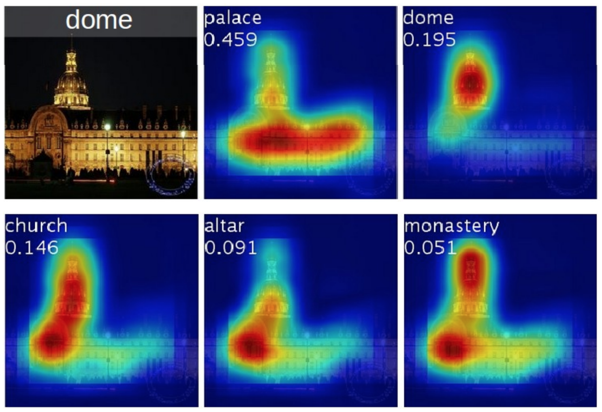{: width="450" height="300"}{: .center-image}

그림에서 각 class에 따라 중요한 부위가 붉게 표시됨을 볼 수 있다. 

### 2-2. AdaLIN 

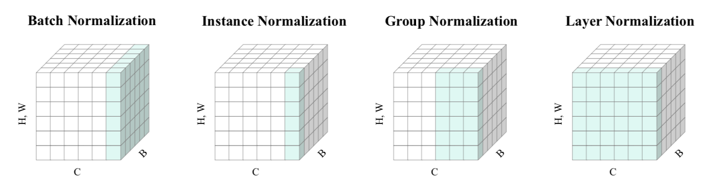{: width="700" height="180"}{: .center-image}

Instance norm은 spatial 정보(H,W)만을 통으로 normalize 시킨다. 또한 각 feature channel 간의 uncorrelation을 가정하므로 source domain의 shape은 유지하지만 target domain의 (세부적) style 전파에는 약하다(전체 하나의 대표적 스타일 하나만 뽑아낸다). 

하지만 Layer norm은 반대이다. 각 feature channel 간의 uncorrelation을 가정하므로 shape 유지는 약하지만 style 변환에는 좋은 성능을 보인다. 따라서 서로 보완하는 장단점을 갖은 두 normalization 기법을 적절히 섞어 제안하는 것이 AdaLIN이다. 위 그림은 이 [논문](https://arxiv.org/abs/1907.04312)에서 차용했다. 

## 3. U-GAT-IT Architecture 

* 목적 : $S$(혹은 $T$) 도메인에서 $T$ 도메인으로 image-to-image translation
* 입력 : $S$(혹은 $T$) 도메인의 이미지 
* 출력 : $T$ 도메인의 이미지, CAM feature map(=attention module)
* 구성 network 
    1. Generator 
    2. Discriminator 
* 특징 : 
    - 총 4개의 네트워크 ($G_{s→t}$,$G_{t→s}$,$D_s$,$D_t$)
    - 출력으로 나오는 attention module은 Generator혹은 Discriminator의 중간 과정에서 생성됨 
    - 두 종류의 attention module은 역할이 다름 
        - In Generator : $S$와 $T$를 구분하는 가장 큰 region을 탐색 
        - In Discriminator : 생성 이미지가 target 도메인 이미지와 가장 다른 부분을 찾고 이 부분을 generator에 알려줌 

### 3-1. Generator 

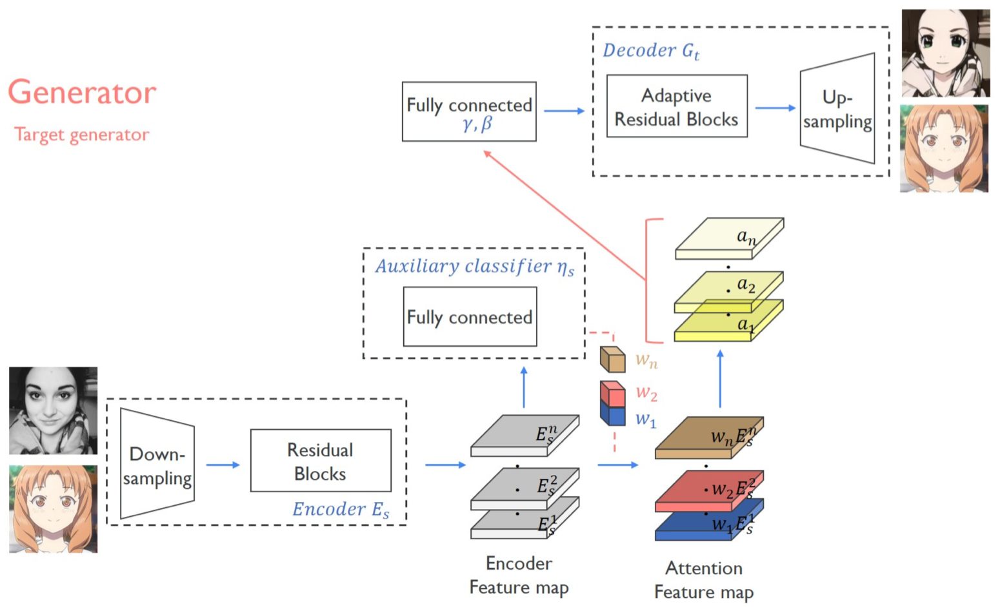{: width="600" height="360"}{: .center-image}

* 목적 : $T$ 도메인으로 바뀐 이미지 
* 입력 : $S$와 $T$ 도메인의 이미지들 
* 출력 : $S→T$로 $T→T$로 바뀐 이미지 
* 구성 network 
    1. Encoder 
    2. Auxiliary classifier $\eta_S$
    3. Fully connected for $\gamma$, $\beta$ 
    4. Decoder 
* 특징 : 
    - 전형적인 auto encoder 구조
    - Auxiliary ~ Decoder 과정 
    
    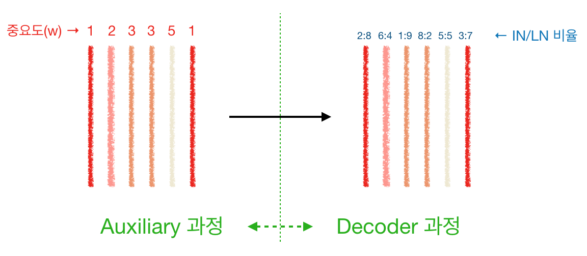{: width="600" height="260"}{: .center-image}

    auxiliary 과정이 끝나면 **feature map 들에 중요도(weight)가 가중되어 중요한/덜 중요한/안 중요한 feature map**이 생성된다. 이는 입력으로 들어오는 이미지의 도메인에 종속적이며 이미지의 특정 region이 어떤지에도 종속적이다. 이후 AdaLIN이 적용되면 가중된 **각 feature map을 어느 비율로 IN과 LN을 섞을지 결정**하는 단계로 넘어가게 된다. 즉, 각 map의 정보를 어느 정도 살릴지/날릴지를 결정하는 단계이다. 
    
#### Encoder 

* 입력 : 각 도메인($S$,$T$)의 이미지 
* 출력 : 입력 이미지를 encoding한 feature map 

#### Auxiliary Classifier $\eta_S$

* 목적 : 입력 이미지의 feature map이 $X_S$에서 왔을 확률. 즉, 어느 이미지의 feature map인지를 확인하는 목적 
* 입력 : encoding 된 feature map 
* 출력 : 중요도에따라 가중된 feature map 
* 의의 : feature map의 어느 channel이 어느정도 중요한지(weight)를 구하는 것 
* 특징 : 
    - 학습되는 것은 각 channel에 곱해지는 weight value임
    - 가중치가 곱해진 feature map을 원본 이미지 크기에 맞게 resize하면 흔히 보는 CAM의 이미지를 얻을 수 있음
    - 실제 오픈 코드 상에는 global average pooling(GAP)과 global max pooling(GMP) 두 경우를 다 구해서 concat, downsizing 과정을 거침 

#### Fully connected for $\gamma$, $\beta$ 

* 목적 : Decoding 과정에서 사용할 $\gamma$, $\beta$ 를 구함 
* 입력 : 가중된 feature map
* 출력 : $\gamma$, $\beta$ 
* 의의 : 
    - $\gamma$와 $\beta$는 (IN 혹은 LN으로) Noramlize 된 feature map을 de-normalize 시킬 때, 어느 정도로 그 과정을 수행할지 정하는 parameter임 
    - 각 channel이 가중되어있고, IN과 LN을 어느 정도 공유하는 과정에서 정보 손실 혹은 부족함을 채워주기 위해 사용한 것으로 보임 

#### Decoder 

* 목적 : 가중된 feature map을 이미지로 만들어 냄
* 입력 : 가중된 feature map(Auxiliary의 출력), $\gamma$, $\beta$(Fully connected의 출력)
* 출력 : $X_T$ 도메인 이미지 
* 특징 : 
    - 입력들을 바탕으로 IN과 LN을 이용한 de-normalization 과정을 적절히 섞어 진행함
    - $\hat{\alpha_I}$ : IN normalization 
    - $\hat{\alpha_L}$ : LN normalization
    - $\rho$ : AdaIN과 LN의 중요도를 나타냄

$$
AdaLIN(\alpha, \gamma, \beta)=\gamma \cdot (\rho\cdot\hat{\alpha_I}+(1-\rho)\cdot\hat{\alpha_L}) + \beta 
$$

### 3-2. Discriminator 

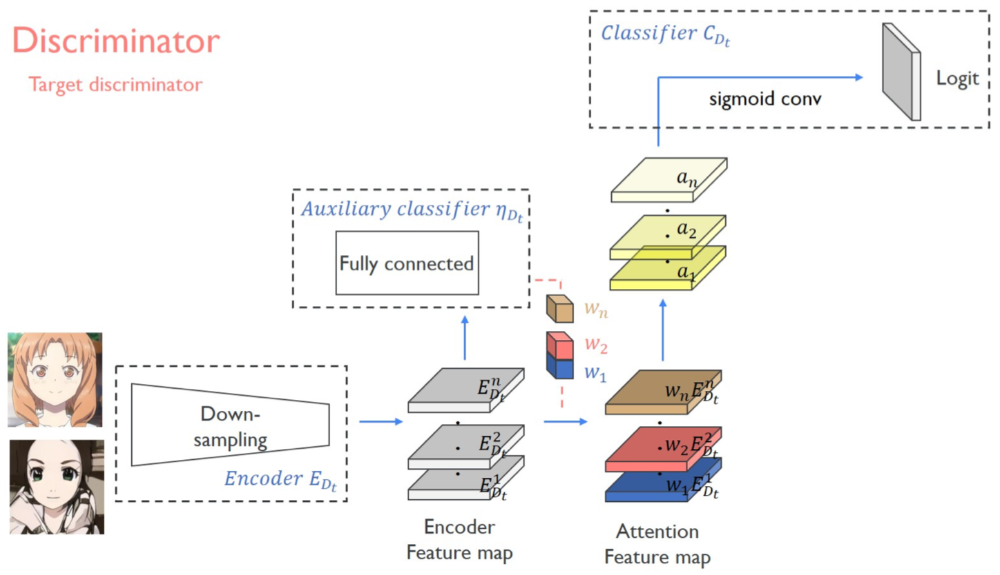{: width="580" height="360"}{: .center-image}

* 목적 : 실제 $T$ 도메인 이미지인지 생성된 이미지 인지를 구분 
* 입력 : $T$ 도메인의 이미지들과 $S$ 도메인 이미지를 이용해 생성한($S→T$) 이미지
* 출력 : True / False logit
* 구성 network 
    1. Encoder 
    2. Auxiliary classifier $\eta_{D_t}$
    3. Classifier 
* 특징 : 
    - 서로 다른 두 receptive field 크기(70x70과 286x286)를 갖는 두 개의 discriminator를 사용 
    - Encoder는 3-1. Generator과 같음(설명 X)
    - Auxiliary classifier는 비슷함 

#### Auxiliary classifier $\eta_{D_t}$

* 목적 : 실제 $T$ 도메인 이미지인지 생성된 이미지 인지를 classify. 즉, 생성된 이미지와 실제 이미지를 비교해가면서 어느 부분이 부족한지, 생성자가 더 그럴듯하게 만들어야 하는 부위를 지시해줌 
* 입력 : Generator의 것과 같음 
* 출력 : Generator의 것과 같음 

#### Classifier 

* 목적 : 원본 $T$ 도메인 이미지의 가중 feature map인지, 생성 이미지의 그것인지를 구분 
* 입력 : 가중된 feature map
* 출력 : (patchGAN 형태의) True / False logit 

## 4. Loss function 

### 4-1. Adversarial loss 

[Least Squares GAN](https://arxiv.org/abs/1611.04076)의 adversarial loss를 참고해서 다음과 같이 설계하였다. 

$$
L_{gan}^{s→t}=E_{x∼X_t}[(D_t(x))^2] + E_{x∼X_s}[(1-D_t(G_{s→t}(x)))^2]
$$

### 4-2. Cycle Loss 

생성자의 입력이 $S$ 도메인에서 선택된 경우 사용한다. 생성된 이미지가 원본 이미지와 비슷하면서 그럴듯한(no artifact) 이미지가 나와야 한다는 제약조건이며 동시에 mode collapse를 방지한다. 

$$
L_{cycle}^{s→t}=E_{x∼X_s}[|x-G_{t→s}(G_{s→t}(x)))|_1]
$$

### 4-3. Identity loss 

생성자의 입력이 $T$ 도메인에서 선택된 경우 사용한다. 생성자로 하여금 $S$ 도메인의 이미지가 아니고 $T$ 도메인 이미지가 들어와도 역시 $T$ 이미지를 만들어 내는 견고함을 제공해 준다. 이와 비슷한 컨셉이 이전 facebook의 이 [논문](https://arxiv.org/abs/1611.02200)에도 제시된 적 있다.

$$
L_{identity}^{s→t}=E_{x∼X_t}[|x-G_{s→t}(x))|_1]
$$

### 4-4. CAM loss 

Generator 과정과 Discriminator 과정에서 따로 사용되는 Auxiliary classifier에 사용되는 loss로 전자의 경우는 어떤 도메인에서 왔는지를 비교해 각 도메인을 구분하는 중요한 feature map을 선택하고 후자의 경우 생성된 이미지와 실제 이미지 사이에 구분되는 주된 feature map을 학습하도록 구성된다. 

$$
L_{cam}^{s→t}=-(E_{x∼X_s}[log(\eta_s(x))]+E_{x∼X_t}[log(1-\eta_s(x))])
$$

$$
L_{cam}^{D_t}=E_{x∼X_t}[(\eta_{D_t}(x))^2]+E_{x∼X_s}[log(1-\eta_{D_t}(G_{s→t}(x)))^2]
$$

$D_t$의 경우(아래) discriminator의 adv loss가 [Least Squares GAN](https://arxiv.org/abs/1611.04076)의 형태를 따라갔고 이에 대응하기 위해 제곱의 형태가 붙은 듯 하다. 그리고 논문상에 이 loss의 $X_s$ 도메인에 해당하는 loss에 $log$가 빠진듯(?)하다. 

### 4-5. Full objective 

$$
\min_{G_{s→t},G_{t→s},\eta_{s},\eta_{t}} \max_{D_s, D_t, \eta_{D_s}, \eta_{D_t}} \lambda_1 L_{gan} + \lambda_2 L_{cycle} + \lambda_3 L_{identity} + \lambda_4 L_{cam}
$$

최종 Loss 식으로 4개의 네트워크 모두(즉, $s → t$와 $t → s$경우 포함)를 아우르는 손실함수이다. 각 $lambda$의 값은 다음과 같다: $\lambda_1$=1, $\lambda_2$=10, $\lambda_3$=10, $\lambda_4$=1000. 눈여겨볼 점은 $lambda_4$의 경우 값이 1000으로 **전체 네트워크는 axiliary network에 매우 큰 의존**을 하고 있다고 볼 수 있다. 

## 5. Experiments 

이 논문에서 제안하는 CAM과정과 AdaLIN과정을 ablation study의 형태로 유효성을 보여준다. 또한 제안하는 방식의 타당성을 양적/질적 평가로 보여주고 있다. 

### 5-1. Baseline Model 

다음 4개의 선행 연구를 base model로 선정했다. 

- [CycleGAN](https://arxiv.org/abs/1703.10593)
- [UNIT](https://arxiv.org/abs/1703.00848)
- [MUNIT](https://arxiv.org/abs/1703.00848)
- [DRIT](https://arxiv.org/abs/1808.00948)

### 5-2. Dataset

다음의 5개의 데이터 셋을 확보해서 실험을 진행하였다. 2와 3은 CycleGAN에서, 4와 5는 DRIT 논문에서 사용되었다. 1은 본 논문을 위해 만든 데이터 셋으로 구하는 과정부터 구체적인 데이터 셋의 크기, 크로핑과 super resolution 과정은 논문에 자세히 설명되어있다. 특징은 selfie와 anime 모두 여성의 이미지로만 이루어져 있다 (아마 남성 anime는 희소해서 그런 듯). 

1. selfie2anime
2. horse2zebra 
3. photo2vangogh
4. cat2dog 
5. photo2portrait

### 5-3. Result 

#### CAM의 유효성 

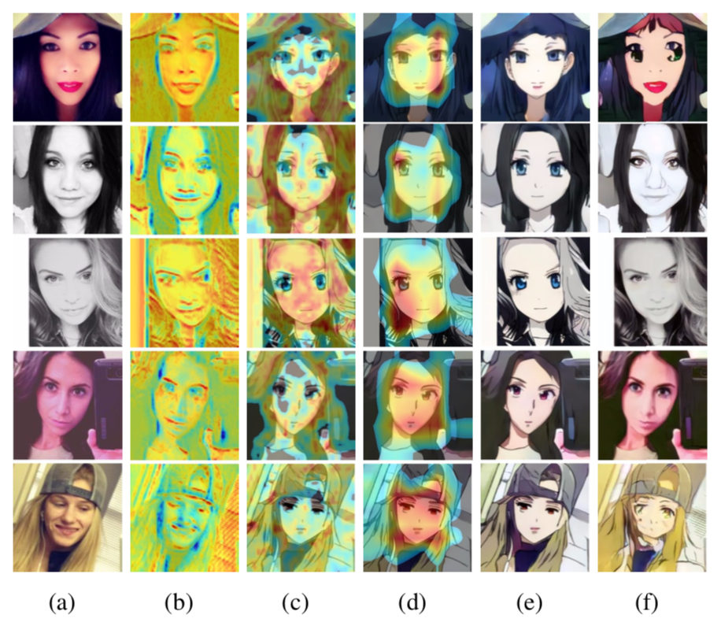{: width="530" height="480"}{: .center-image}

(b)는 generator의 CAM (c)는 discriminator의 local CAM, (d)는 global CAM이다. (b)의 경우 source 이미지와 target 이미지 사이의 차이가 나는 부분(눈, 입)이 잘 표시된다고 한다(지만 그 외의 부분도 activate된 듯한 느낌이 든다...). 그리고 (c)와 (d)의 경우 눈에 띄는 차이가 보였고 넓게 봤을때 주의해야 하는 부분과 좁게 봤을때 집중해서 바꿔야 하는 부분을 찾았다는 점은 납득이 되었다. (e)는 CAM을 사용한 경우의 (f)는 CAM을 쓰지 않은 경우의 생성 이미지이다. 개인적으로 generator와 discriminator 각각의 CAM 유무에 따른 결과도 궁금하다.  

아래 이미지는 다른 데이터 셋을 활용한 generator에서의 CAM 이미지이다. 개 vs 고양이의 경우는 눈과 코에 activate가 주로 되었다. 의미가 와닿는 경우다. 하지만 photo vs portrait나 풍경 사진의 activate는 일관성이 잘 안 보인다. 

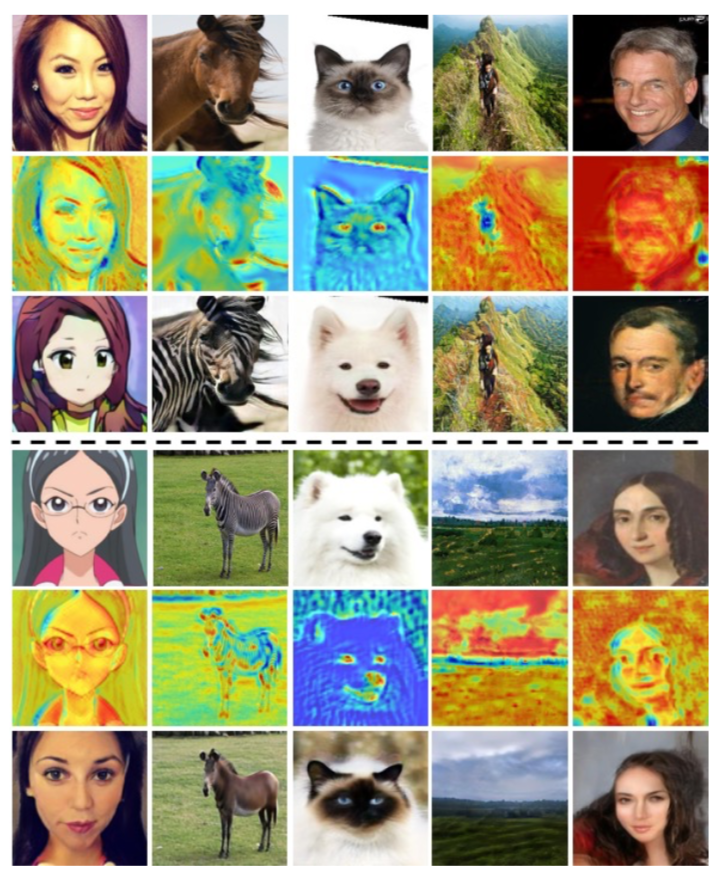{: width="420" height="500"}{: .center-image}

#### AdaLIN의 유효성 

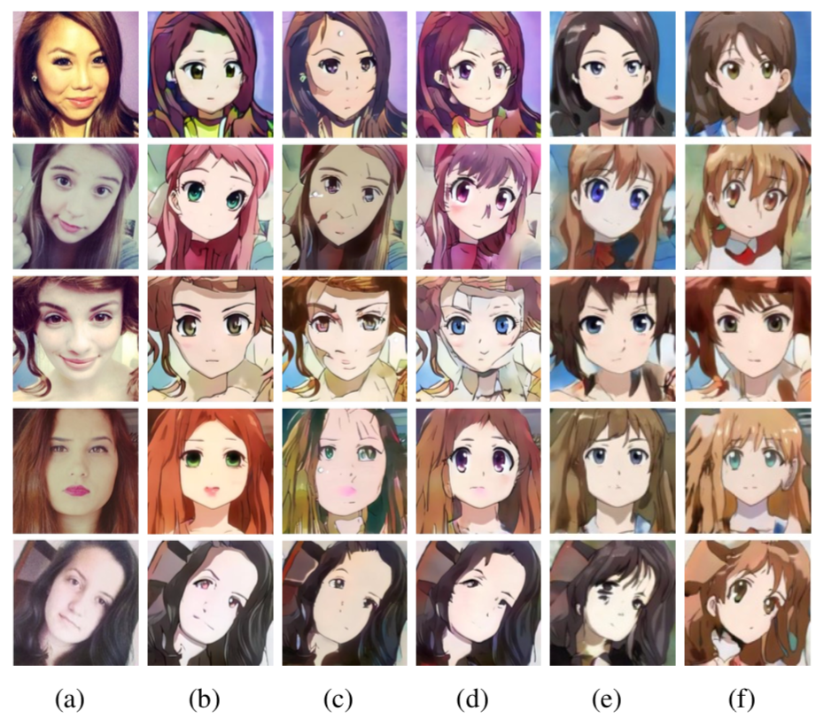{: width="530" height="500"}{: .center-image}

(a)와 (b)는 각각 입력 이미지와 논문의 결과 이미지이다. 다음 결과들은 각각 오직 Instance norm, Layer norm, AdaIN, Group norm을 사용한 경우이다. IN과 LN을 적절히 섞는 제안을 한 만큼 (b),(c),(d)를 눈여겨볼 필요가 있다. Basic Idea의 설명에서처럼 IN과 LN을 적절히 섞은 (b)의 경우 (c),(d)보다 그럴듯한 결과를 보여주며 (e), (f)보다 좋은 결과를 그려냈다. AdaIN과 GN의 특성도 살펴보고 이를 AdaLIN과 비교해 봐야겠다. 

#### 질적 평가 

{: width="700" height="200"}{: .center-image}

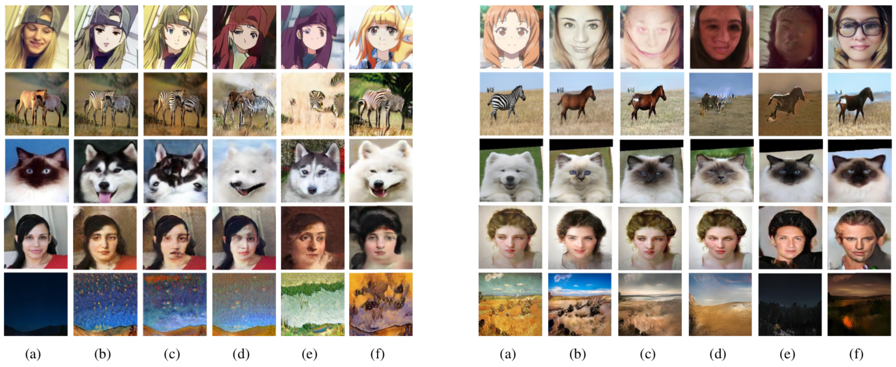{: width="900" height="300"}{: .center-image}

질적 평가를 위해 135명의 실험자를 대상으로 user study를 진행했다. 표 아래 그림이 평가에 사용되었던 그림의 일부(좌 : $S → T$ / 우 : $T → S$ )이다. 결과적으로 대부분의 데이터 셋에서 U-GAT-IT이 압도적으로 좋은 평가를 받았다. photo2portrait에서만 UNIT이 좋은 평가를 받았는데 그 차이는 U-GAT-IT과 크지 않다. 이에 해당해서 예시 그림 좌측의 4번째 줄 결과로만 보건대, (b)와 (d)의 생성 이미지가 적합성에서 둘 다 부족해 보인다. 네트워크의 성능이라기보다는 데이터의 문제로 보는게 맞는듯싶다. 

#### 양적 평가 

* 평가 metric : [Kernel Inception Distance](https://arxiv.org/abs/1801.01401)(KID)를 사용했다. 이는 FID와 마찬가지로 생성 이미지와 실제 이미지를 이용해 특정 네트워크(Inception)을 통과시킨 feature map의 유사도를 측정한 방법이다. 측정에 사용되는 feature map은 ReLU를 통과한 값 들이다. 따라서 많은 값들이 0인데 이는 일반적인 연속형 확률 분포(적분이 1이라든지..)의 형태가 아니게 된다. FID는 이 분포를 parametric 방식(평균 등)으로 추정하고 거리를 측정하는데, 일반적인 분포의 형태가 아니므로 적절한 방법이 아니다. 이를 보완하기 위해 un-parametric 방식(unbaised estimator 방식)으로 거리를 측정한 방법이 KID이다(이게 수식적으로도 구하기 쉽다고 하는데 수식이 너무 많아서 pass..). 이 과정에서 장점이 한 가지 있다: FID보다 적은 수의 테스트 이미지 만으로도 측정이 가능하다고 한다. Distance이므로 값이 작은 게 좋다. 

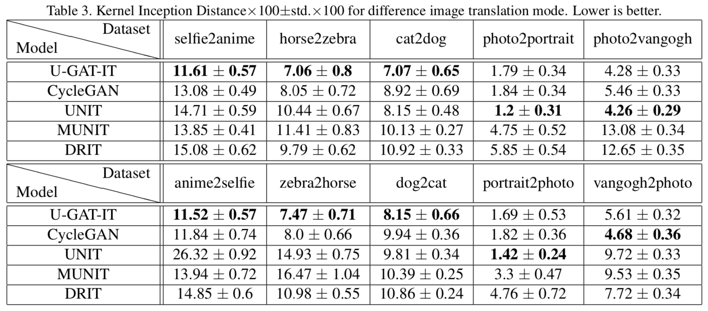{: width="700" height="300"}{: .center-image}

총 5가지의 데이터 셋 중 3가지 경우 U-GAT-IT이 좋은 성능을 보였다. 다른 두 경우인 photo2portrain와 photo2vangogh($S$와 $T$의 반대 경우도)는 원래 stlye transfer task고 그래서 성능이 조금 떨어진다고 한다. 데이터 셋에 목적이 따로 있다고는 생각이 들지 않는다. 다만 데이터 셋의 크기가 결과에 영향을 미친 게 아닐까 생각이 든다.  

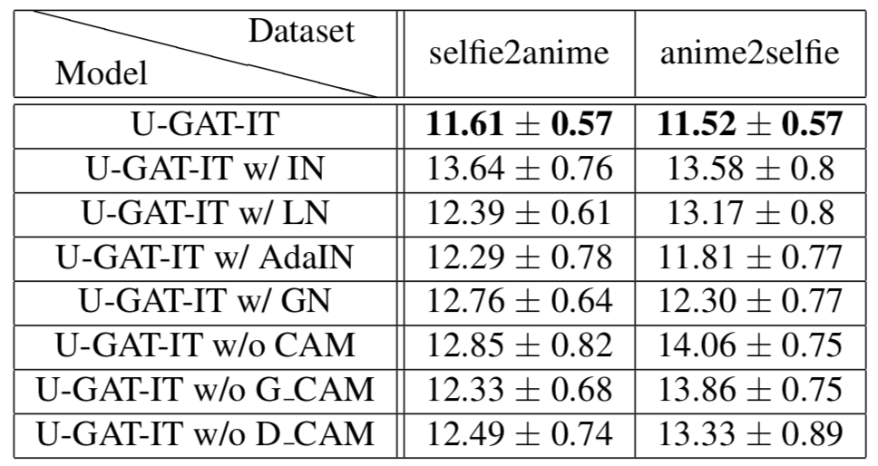{: width="400" height="215"}{: .center-image}

CAM과 AdaLIN의 유무에 따른 KID score를 보여준다. 둘 중 하나만 있는 경우에 score가 월등히 낮거나, 높거나 하지 않는 양상을 보면 이 두 구조가 서로 상호 보완적이라는 생각이 든다. 또한 이 둘이 함께 있을 경우에 그 효과가 잘 나타난다고 생각된다. 

#### 기타 평가 

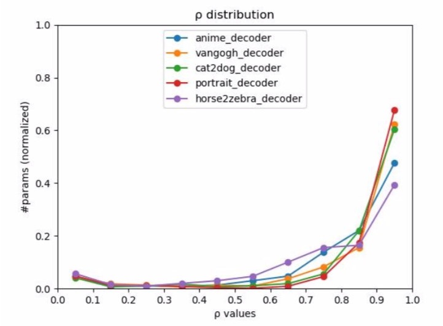{: width="400" height="300"}{: .center-image}

$\rho$값의 변화와 서로 다른 데이터 셋이라는 변인에 따라 그린 그래프이다. $\rho$값이 0에 가까우면 LN을 1에 가까우면 IN에 집중한다는 의미이다. 하지만 명확히 y 축이 의미하는 바를 모르겠다. #라고 적혀있는데 값의 range가 0~1 인 것을 보면 ratio로 봐야 하는 건지... 그리고 데이터 셋마다 다른 특징적인 모양을 보여주는 것도 아닌듯하다. 그래서 논문에서 말한 IN이 어느 경우에 더 잘하고, AdaIN의 $\rho$가 1에 가까운지 명확히 와닿지가 않는다. 

## 6. Conclusion

[SAGAN](https://arxiv.org/abs/1805.08318)이 나오고 attention을 gan에 적용하는 방법의 논문들이 다수 나왔고, 그런 방법의 연장선으로 개선된 모델을 고민했었는데 CAM으로 새로운 translation 논문이 나온 점이 신선했다. 또한 normalization 기법은 목적과 상황 그리고 데이터 셋에 따라 접근 방식이 룰처럼 적용되고 있었는데 이러한 기법 중 IN와 LN의 특성을 파악하고 이를 동시에 적용시킨 점이 매우 놀라웠다. 평가 부분에서 조금 아쉬운 부분이 있었지만 이렇게 제안했던 두 컨셉이 서로 보완적인 관계로 네트워크에 녹아졌다는 점이 좋았다. 
