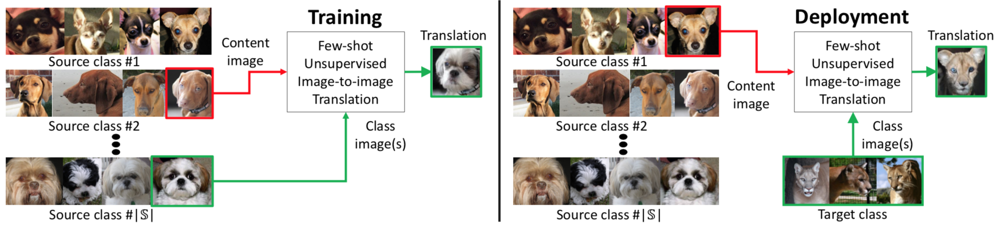
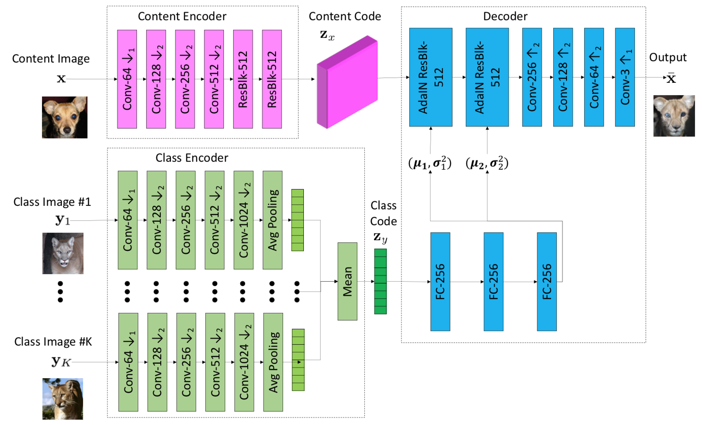
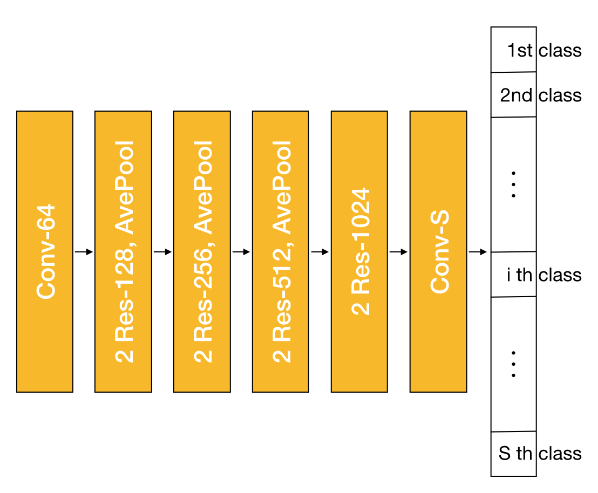
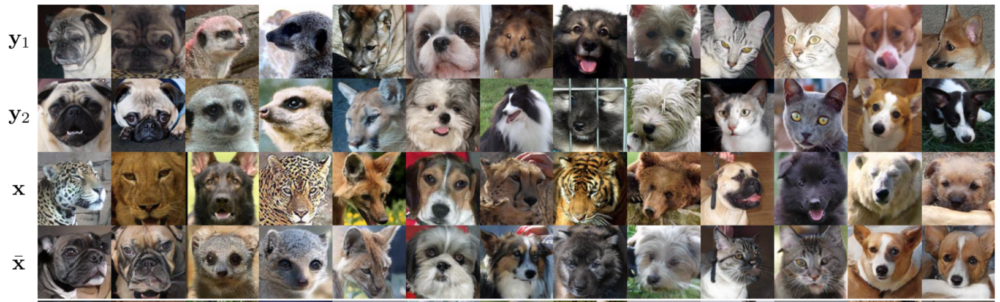
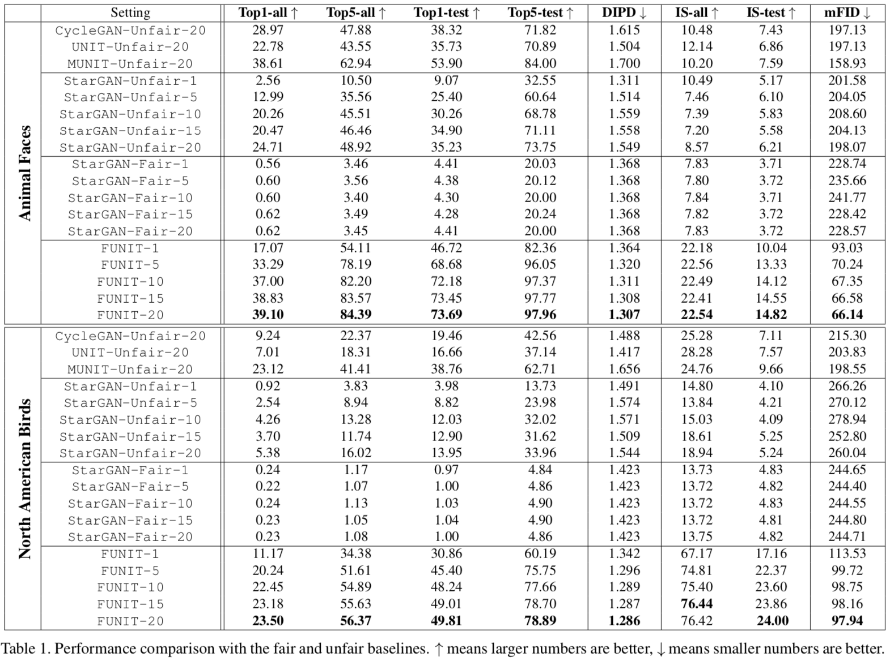
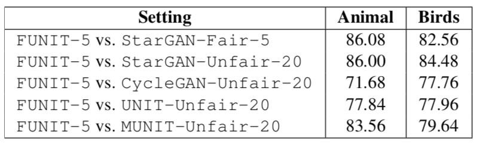
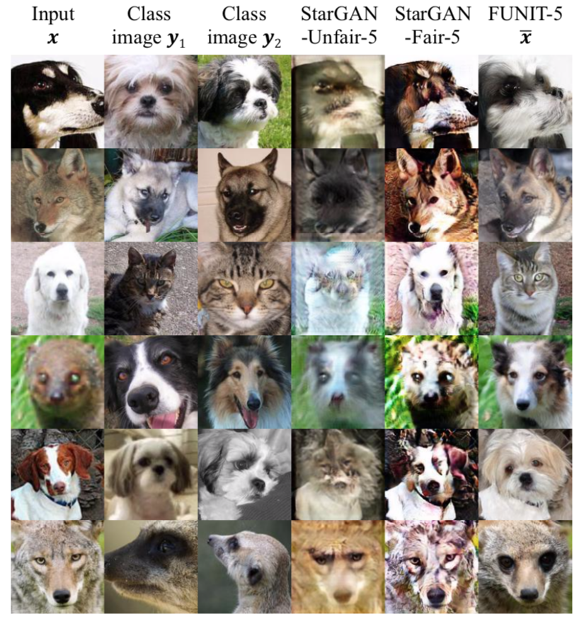
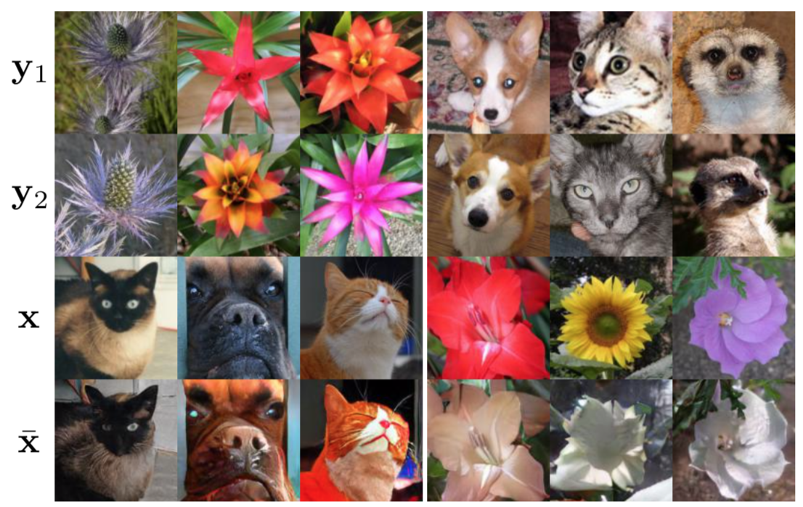

2019년도 초와 중순에 나온 StyleGAN과 GAUGAN과 같은 NVIDIA의 논문들은 완성도가 높고 논문 설명 비디오가 큰 이슈를 끈다(GPU가 빵빵해서 그런가..). 이번에도 NIVIDA에서 나온 FUNIT 논문을 리뷰 해 볼 것이다. 커뮤니티에서 오르내리는 빈도(?)가 앞선 두 논문보다 낮다고 생각되지만 [프로젝트 페이지](https://nvlabs.github.io/FUNIT/)의 GIF를 보면 그 결과가 매우 놀랍다. I2I translation 과정에서 destination 도메인 데이터가 부족한 상황을 해결하기 위한 논문으로 큰 구조 자체는 MUNIT의 구조를 조금 변형한 형태로 보인다. 하지만 다루는 데이터의 도메인이 다르다. 

## 1. Introduction 

### 배경 

GAN을 이용한 unsupervised image to image translation 분야는 많은 발전이 있어왔다. 하지만 training 데이터가 적은 경우(Few shot) 이미지 생성에 실패하는 경우가 많다. 사람의 경우 (이전에 경험한 경험을 바탕으로) 처음 보는 이미지도 일반화를 잘 하는데(예를 들어, 다른 각도에서 어떻게 보일지 등) 지금까지의 GAN 모델은 그에 미치지 못하는 수준이다. 

> A person seeing a standing tiger for the first time will have no trouble imagining what it will look lying down, given a lifetime of experience of other animals.

### 문제 및 중요성 

Source와 destination 도메인의 데이터 수는 결과에 영향을 크게 미치는 변수이고 이것의 부족 혹은 비대칭은 I2I translation 테스크에서(물론 다른 문제에서도 마찬가지이고) 큰 문제점이다.

### 논문의 목표 

각 도메인의 데이터 수가 비대칭일 경우 source 도메인의 데이터를 일반화시켜 destination 도메인에도 잘 적용시켜 부족한 데이터 문제를 해결한다. 

## 2. Basic Idea 

{: width="600" height="150"}{: .center-image}

### 전체 과정 

이 논문은 전체 데이터 셋을 여러 class로 나누고 이렇게 나뉜 class 사이에서 translation을 진행한다. 예를 들어, 위 그림에서처럼 class #1은 폭스테리어(종) class #2는 해리어(종) class #$S$은 시츄(종)과 같이 나누고 해리어 중 하나의 이미지 structure 요소를 갖고 거기에 맞춰 시츄 스타일의 입히는 방식이다. 보통은 translation의 출발지와 목적지가 하나씩 딱 정해져 있는데 이 경우는 여러 후보들이 있고 그것들 중 하나가 출발지 다른 하나가 목적지가 되는 형태이다. 

### 용어 정리 

해당 논문에서 쓰이는 용어를 조금 정리한다. 

- content image : train와 test 과정에서 *content*로 사용할 이미지 (1개만 사용)

- class image   : train와 test 과정에서 *style*로 사용할 이미지 K 개 
    - K는 train 과정에서는 1, test 과정에서는 1, 5, 10, 15, 20을 사용함 

- object class  : **train** 과정에서 class image(들)를 담고 있는 class 

- source class : train 과정에서 학습에 사용될 class들. 이 class들 중 하나가 content image를 담고 있고 또 다른 하나가 class image를 담고 있음. 

- target class  : **test** 과정에서 class image(들)를 담고 있는 class

전체 데이터는 source class 들과 target class로 이루어져 있다. 

### 진짜 Basic Idea 

도메인 A에서 도메인 B로 잘'만' 바꿔보자는 기존의 방식과는 다르게, **잘 바꾸는 것뿐만 아니라 학습 과정에서 일반화 능력까지 같이 학습**시키는 것을 목표로 한다. 

Train 과정은 (MUNIT과 같은) 일반적인 I2I translation 과정과 비슷하다. Content 이미지는 auto-encoder 과정을 거치며 decoding 과정에서 style이 입혀진다. Style을 입히는 과정은 AdaIN과 class code(class 이미지를 encode 시켜서 얻음)를 사용한다. 구조는 기존 방법과 비슷하지만 사용하는 데이터 자체가 <u>여러 도메인(class)을 사용</u>한다는 차이점이 있다. 그래서 class code는 각 도메인(class)가 어떤 style적인 특성을 갖고 있는지를 의미한다(예를 들어 시츄는 코가 뭉특하고 주둥이가 짧으며 털 색이 요렇다와 같이...). 또한 auto-encoder 네트워크는 어떤 도메인(class)의 이미지가 들어와도 structure 정보만을 잘 뽑아내고 이에 style을 잘 입히도록 탄탄하게 학습될 수 있다. 물론 그만큼 학습이 느리고 많은 하드웨어 장비가 필요할 듯싶다.

Test 과정은 class encoder를 통해 K 개 만큼의 이미지를 받아들인다. Class encoder 입장에서는 train 과정에서 보지 못했던 도메인(class)이므로 그 도메인만의 정확한 style 정보를 뽑아낼 수 없다. 이를 방지하게 위해 K 개의 class code를 서로 평균을 내므로써 이 문제를 해결하려 했다. 

학습이 진행되는 상황에서 생성자가 여러 도메인의 데이터에 접하고, 접하는 이미지도 많지 않다. 즉 **적은 수의 데이터로 '일반적'으로 이런 특성을 뽑고 기억해야 한다**는 것을 학습시키는 것으로 보인다. 

## 4. FUNIT Architecture 

* 목적 : 몇 개(few shot)의 Target class의 이미지만을 이용해 입력 이미지와 출력 이미지 사이의 mapping을 가능하게 함 
* 입력 : Source class의 이미지 
* 출력 : Target class에 있을 법 한 입력과 비슷하게 생긴 이미지 
* 구성 network 
    1. Few-shot Image Translator($G$)
    2. Multi-task Adversarial Discriminator($D$)
* 특징 : 
    - Source class가 각각 하나의 도메인이므로 단순 discriminator를 사용하지 못하고 multi-task discriminator를 도입함
    - NO PAIRED : 다른 class의 사진 속 어떤 객체도 같은 포즈는 없음 

### 4-1. Few-shot Image Translator ($G$)

{: width="600" height="360"}{: .center-image}

* 목적 : 두 개의 입력 이미지로 출력 이미지를 만들어 내기 ($\bar{x}=G(x, \{y_1, ..., y_K\})$)
* 입력 : 
    1. content 이미지 ($x$)
    2. object class 안의 k 개 class 이미지 ($\{y_1, ..., y_K\}$) 
* 출력 : 
    1. content 이미지의 구조와 class 이미지의 style을 갖는 이미지 ($\bar{x}$)
* 구성 network 
    1. Content Encoder $E_x$
        - Content 이미지 $x$를 content latent code $z_x$로 변환 
        - 생성된 $z_x$는 content 이미지의 구조적 특징을 의미함 
    2. Class Encoder  $E_y$
        - 각 class 이미지 $y_i$를 각 class code $z_{y_{i}}$로 변환, $i=\{1,...,K\}$
        - K가 복수 개인 경우(test 과정) $z_{y_{i}}$를 element-wise mean을 취해 $z_y$를 만들어 냄 
        - 생성된 $z_y$는 해당 class의 스타일적 특징을 의미함
    3. Decoder $F_x$
        - Normalization layer로 AdaIN을 사용하는 residual block으로 구성 (AdaIN ResBlk)
        - 2개의 fully-connected layer를 이용해 AdaIN affine transformation parameter를 구함 
* 특징 : 
    - 각 경우에 따른 K 
        - train 일 때 : 1개 
        - test 일 때 : 1개, 5개, 10개, 15개, 20개 
    - Source class가 많을수록 더 좋은 few shot translation 성능을 보임 

### 4-2. Multi-task adversarial discriminator 

* 목적 : 생성된 이미지가 실제 이미지와 비슷하게 생성되게 하는 것 
* 입력 : 생성 이미지($\bar{x}$) 혹은 object class의 class 이미지($y$) 
* 출력 : $S$사이즈의 binary classification vector

{: width="350" height="280"}{: .center-image}

위 그림은 논문에 나와있는 discriminator 아키텍처 체인을 그린 것이다. 네트워크의 출력은 크기가 S인 vector이며 S는 source class의 총개수이다. 도메인(class)의 수가 다수이므로 이를 대응하기 위한 구조로 보인다. 마치 classification task와 같아 보여서 그런지 논문에서도 multiple adversarial classification task라고 설명한다. 각 unit은 0 혹은 1의 값을 갖는 binary value로 1은 'source class의 이미지다!' 0은 '생성 이미지다!'라는 의미를 갖는다. Discriminator를 update 하는 rule은 아래와 같이 일반적 방법을 따른다.

- Update D 
    - Input이 real 이미지인 경우 (from source class)
        - 0('생성 이미지다!')이라고 판단한 경우 penalize
    - Input이 fake 이미지인 경우 (from $G$)
        - 1('실제 이미지다!')이라고 판단한 경우 penalize 

- Update G 
    - Input이 fake 이미지인 경우 (from $G$)
        - 0('생성 이미지다!')이라고 판단한 경우 penalize 

하지만 multi-task이므로 다음의 조건이 추가로 붙는다: <u>선택된 source class가 아닌 유닛은 0이 나오든 1이 나오든 update에 영향을 주지 않는다</u>. 예를 들어, 5번째 class의 이미지를 이용해 네트워크를 학습시킬 때, 8번째 2번째 등 5번째가 아닌 class는 0이 나오든 1이 나오든 상관없다. 논문에서 penalize라는 단어를 사용했는데 그냥 loss의 back-prop을 이용한 update라고 봐도 무방할 듯하다(loss function이 penalty 일 순 있지만 penalty라고 모두 loss function을 의미하는 건 아님). 특별히 어떤 다른 penalty를 적용했다고 명시되어있진 않다. 

## 5. Loss function 

$$
\min_D \max_G L_{GAN}(D,G) + \lambda_R L_R (G) + \lambda_F L_F(G)
$$

### 5-1. GAN loss 

$$
L_{GAN}(G,D)=E_x[-\log{D^{c_x}(x)}]+E_{x,\{y_1,...,y_K\}}[\log{(1-D^{c_y}(\bar{x}))}]
$$

Multi-task adversarial loss로 기본적인 D loss와는 수식이 약간 다르다. 
- Superscipt on discriminator 
    - $D^{c_x}$와 $D^{c_y}$는 각각 받아들이는 도메인(class)이 다르다. 그래서 각 도메인(class)에 해당하는 이미지로 update를 진행한다는 의미이다. 
- $\log{D^{c_x}(x)}$ 앞에 minus(-) 
    - Vanilla GAN의 adv loss를 이용하는 경우 보통 $\log{D(﹒)}$의 입력과 $1-\log{D(﹒)}$의 입력이 비슷해지기를 희망한다. 하지만 이 경우 전자의 입력은 content 이미지 후자의 입력은 생성 이미지로 이 둘이 비슷하기를 바라진 않는다(오히려 object 이미지와 비슷해지기를 희망함). 
    - 또한 $D$의 목표는 각 class에 해당하는 binary value가 0과 1로 적절히 잘 나오는 것이므로 통상적인 adv loss의 의미보다는 classification 문제의 loss와 같은 의미를 갖는다. 따라서 각 항이 모두 값이 작아지길 바라고 그런 의미에서 마이너스가 붙은 것으로 보인다. 

### 5-2. Recontruction Loss 

$$
L_R(G)=E_x[\|x-G(x,\{x\})\|_1^1]
$$

**content 이미지와 object class의 class 이미지가 같은 경우에 사용**한다. 이미지를 똑같이 reconstuction 할 수 있도록 한다.

### 5-3. Feature matching loss 

$$
L_F(G)=E_{x,\{y_1,...,y_K\}}[\|D_f(\bar{x})-\sum\limits_{k} \frac{D_f(y_k)}{K}\|_1^1]
$$

이 loss를 적용하기 위해 feature를 뽑아내는 변형 네트워크($D_f$)를 만들었다. Discriminator의 마지막 layer를 제거함으로써 만들었다고 한다. 생성된 이미지($\bar{x}$)와 class 이미지($\{y_1,...,y_K\}$)가 비슷하기를 희망하기 때문에 네트워크의 중간 feature map을 이용한 L1 loss를 이용한다. 

## 6. Experiments 

### 6-1. Baseline Model 

Target class가 학습에 포함할지, 포함하지 않을지에 따라 baseline model을 분류하였다. 논문에서 포함하지 않는 경우를 Fair, 포함하는 경우를 unfair이라고 표시하였다. 

- Fair 
    - [StarGAN](https://arxiv.org/abs/1711.09020)을 조금 변형시킨 모델을 사용하였다. Attribute 기반으로 생성하는 기존 모델을 few-shot generate가 가능하도록 만든 과정이 논문에 설명되어있다. 
- Unfair 
    - [StarGAN](https://arxiv.org/abs/1711.09020)
    - [CycleGAN](https://arxiv.org/abs/1703.10693)
    - [UNIT](https://arxiv.org/abs/1703.00848)
    - [MUNIT](https://arxiv.org/abs/1703.00848)
    - CycleGAN, UNIT, MUNIT은 source class를 first domain으로 target class를 second domain으로 사용하였다고 한다. 

모든 baseline model은 '본래 이름'-'Fair/Unfair'-'K'의 방식으로 논문에서 표현되어있다. 

### 6-2. Dataset

총 4개의 데이터 셋을 확보해서 실험을 진행하였고 데이터셋 이름 / 전체 이미지 수 / source class의 갯수 / target class의 갯수 로 표시하였다.

1. Aniaml Faces / 117574 / 119 / 30 
2. Birds / 48527 / 444 / 111 
3. Flowers / 8189 / 85 / 17 
4. Food / 31395 / 224 / 32 

### 6-3. 평가 Metrics

- Translation Accuracy 
    - 생성 이미지가 target class에 속하는지를 알아보기 위함 
    - Inception-V3 classifier 사용 
    - Source & target 이미지 모두 사용 : all 
    - Target 이미지만 사용 : test 
    - Top1 & Top5 accuracy 사용
- Content preservation
    - Input으로 넣어주는 content 이미지의 percepture 유지력 측정 
    - DIPD(domain invariant percepture distance)라고도 함 
    - Normalized VGG Conv5 feature의 L2 distance 사용 
- Photorealism
    - Inception score 사용 
    - Source & target 이미지 모두 사용 : all 
    - Target 이미지만 사용 : test 
- Distribution matching
    - Frechet Inception Distance(FID) 사용 
    - 모드 target class의 이미지들과 생성 이미지의 1:1 쌍을 바탕으로 FID 값을 구한 뒤 그 값들을 평균함으로 구함(mFID)

### 6-4. Result 

아래 그림은 FUNIT을 K를 5로 설정한 FUNIT의 결과 이미지 중 animal face이다. $y_1$과 $y_2$는 target 이미지의 일부이고, K가 5이므로 저러한 이미지가 3개씩 더 있을 것이다. $x$는 content 이미지고 마지막 $\bar{x}$가 생성된 이미지이다. content 이미지의 구도를 바탕으로 $y_1$과 $y_2$의 스타일적 특성을 반영해 생성하였다. 생성된 모델임에도 디테일과 사실성이 그럴듯하다. 양적, 질적 평가를 아래 적어두었다. 

{: width="600" height="200"}{: .center-image}

#### 양적 평가 

{: width="700" height="500"}{: .center-image}

Bold 하게 표시된 수치가 좋은 수치를 의미한다. 물론 baseline model의 경우 one domain to one domain이 기본인 모델이라는 점을 감안하더라도 모든 경우에서 FUNIT이 좋았고 K를 20으로 설정한 경우 다른 모델의 결과보다 압도적으로 좋았다(K가 커질수록 결과도 보통 좋고 K가 1에서 5로 변할 때 가장 큰 성능적 도약이 보임). 특히 inception model을 통해 보여주는 두 결과(Top 류와 IS 류)는 해당 이미지가 얼마나 사실적으로 보이는가를 의미하는 아주 중요한 척도라고 생각된다. FUNIT보다 성능은 낮지만 MUNIT 또한 좋은 수치를 보여줌에 의미가 있어 보인다. 

#### 질적 평가 

{: width="400" height="130"}{: .center-image}

AMT를 이용해 사용자 평가도 진행했는데 표의 수치는 animal face 데이터 셋과 bird 데이터 셋에 대해 K가 5인 FUNIT과 비교 모델 사이의 선택 비율이다(86이라면 100명 중 86명은 FUNIT이 좋다고 선택, 14명은 비교 모델이 좋다고 선택). Target 이미지와 더 비슷한 이미지를 선택해 달라는 것이 선택의 기준이다. 모든 경우 FUNIT이 압도적이다.

#### 기타 평가 

다음 그림은 다른 model들의 생성 이미지와 K를 5로 설정한 FUNIT의 생성 이미지 비교 이미지이다. 

{: width="400" height="400"}{: .center-image}

물론 FUNIT이 모두 완성적이진 않다. Target 이미지가 content 이미지와 (구조적으로) 너무 다를 경우 생성에 실패한다. 예를 들어 꽃과 강아지처럼(이런 건 사람도 힘들 듯..??)

{: width="600" height="300"}{: .center-image}

뿐만 아니라 다른 실험들(ablation study 등)이 appendix에 설명되어있고 참고할 부분은 추가로 찾아보면 좋을 듯하다. 

## 7. Conclusion

외관이 너무 다르지 않은 unseen 이미지 도메인으로 I2I translation을 가능하게 만든 논문이다. 따라서 학습 과정에서 보지 못하는 데이터에 대비하는 구조와 데이터 세팅이 있었고 그것을 '일반화'라는 관점으로 잘 풀어서 설명했다. (몇 안 되지만, 내가 봤었던) Few-shot 논문들은 데이터가 작아서 잘 안되지만 그래도 조금 된다!를 강조했던 반면 FUNIT은 결과 이미지가 너무 이쁘다. 
