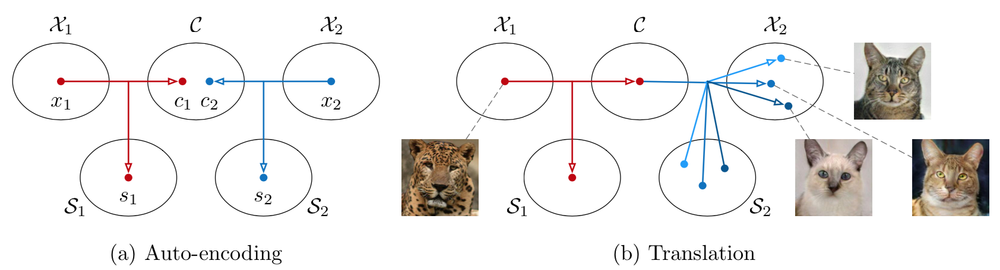
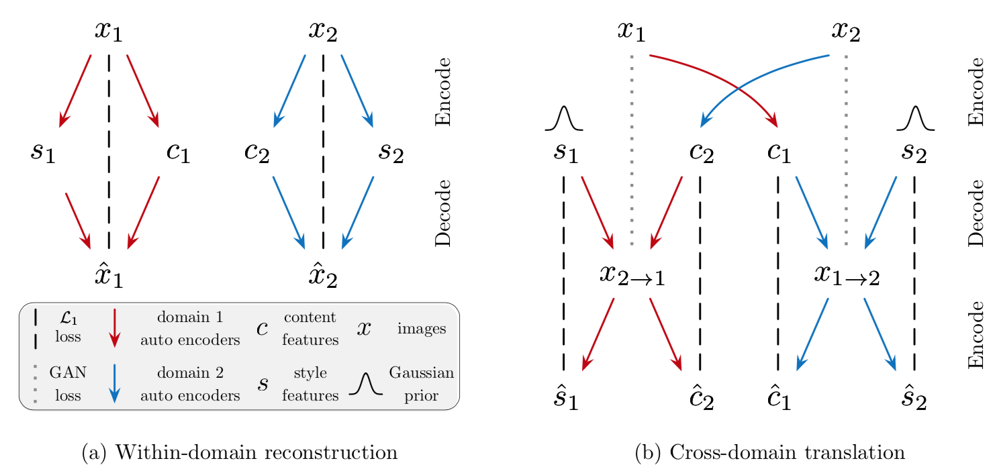
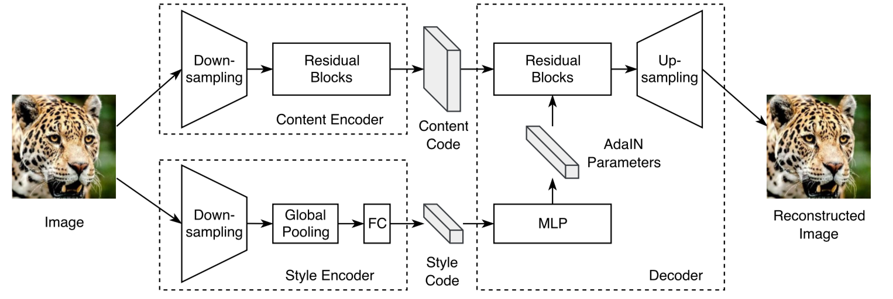
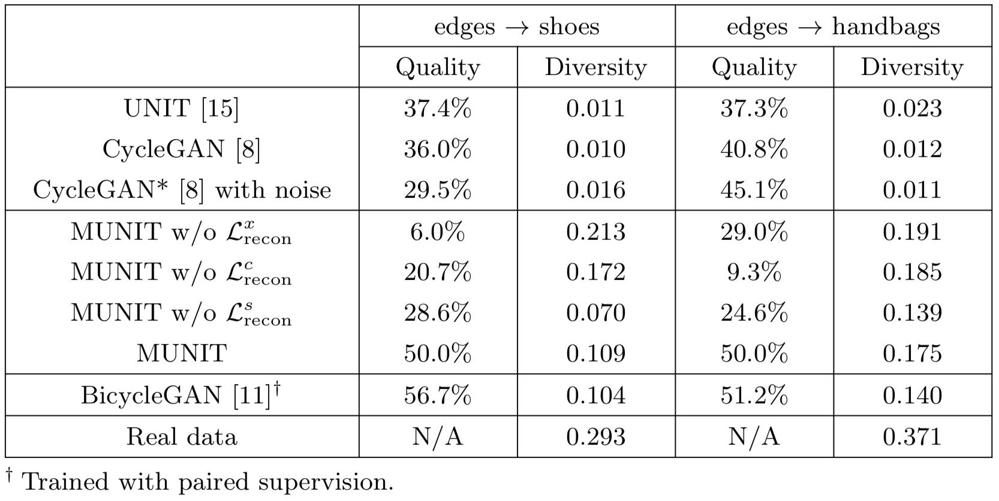
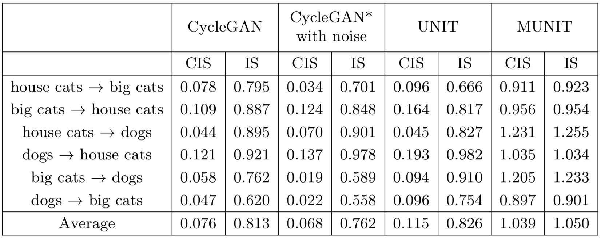
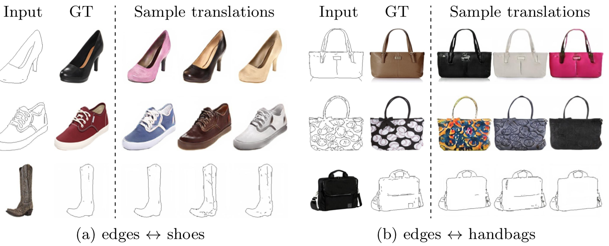
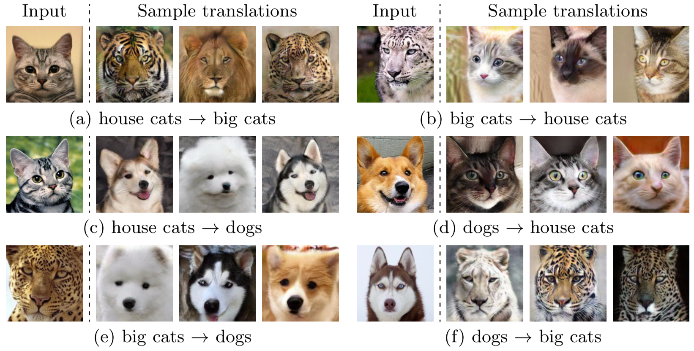
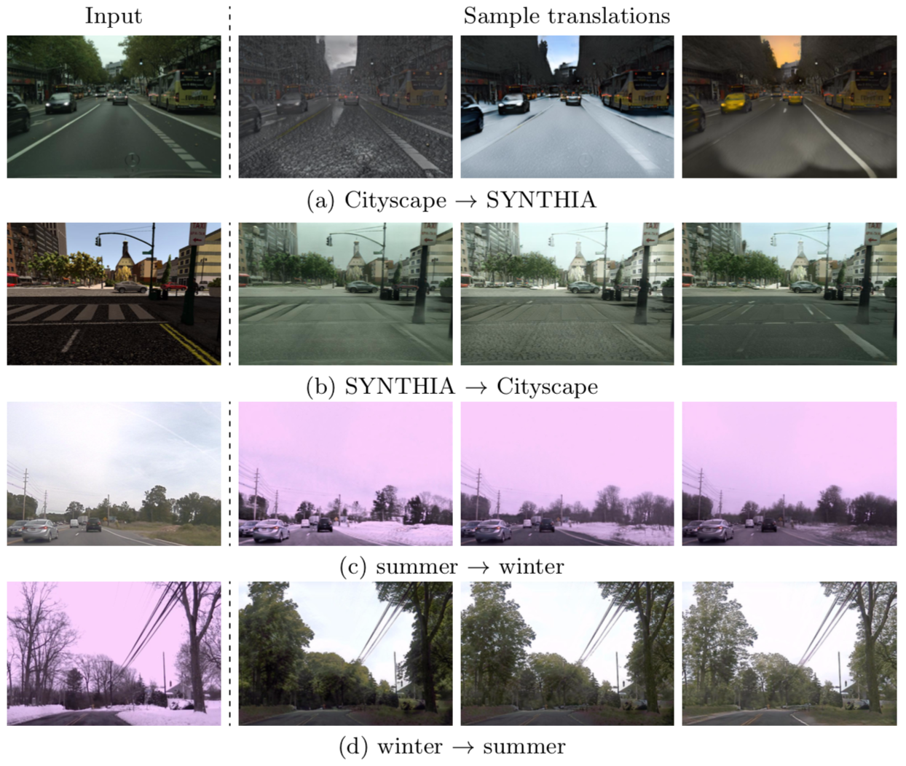
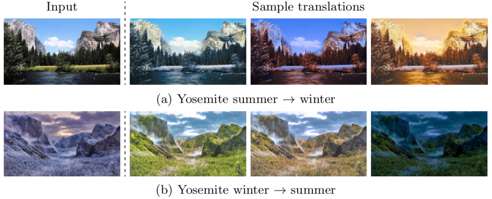
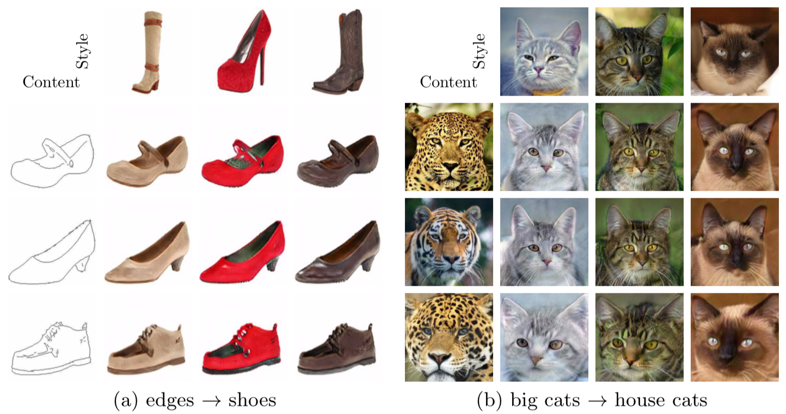

가장 기본적인 GAN은 단순히 noise에서 이미지(혹은 다른 도메인의 무엇)를 생성하는 생성 모델이다. 하지만 이것의 응용 분야는 super resolution, colorization, in-painting style transfer 등 다양하다. 그중 MUNIT은 특정 도메인의 이미지의 특성을 파악하고 이를 다른 도메인에 입히는 image to image translation 분야의 가장 기본이 되는 논문이다. 모델의 컨셉이 좋고 그 결과가 좋아서 지금까지도 해당 분야의 최신 논문에도 베이스 모델로 사용되곤 한다. NVIDIA에서 나온 논문이고 개인적으로 이 분야에 큰 흥미를 느끼게 해준 논문이다. 

## 1. Introduction 

### 배경 

Super resolution, colorization, in-painting, style transfer 등에서 GAN이 많이 활용되고 특히 image to image translation에서도 GAN이 많이 사용된다. 

### 문제 및 중요성 

기존의 방법들은 가능한 결과 이미지들의 완전한 분포를 파악하지 못하였다. 그래서 random noise를 넣어주면 이를 무시하고 이미지를 생성하고 그래서 생성 결과물의 다양성이 부족했다. 만약 완전한 분포를 알아차릴 수 있다면 하나의 입력 이미지에 대해 다양한 결과 이미지를 생성할 수 있다. 예를 들어 여름 사진을 겨울 사진으로 바꿀 때 다양한 시간대(새벽, 아침, 저녁, 밤 등), 빛의 양(화창, 구름, 안개 등), 날씨(비, 눈, 등) 등의 상태로 바꿀 수 있다는 말이다. 

### 논문의 목표 

Unpaired 데이터에 대해 multi modal 결과물을 생성할 수 있는 many to many 이미지 변환을 가능하게 하자.

## 2. Basic Idea 

{: width="400" height="130"}{: .center-image}

#### 가정 (*partially shared latent space assumption*)
- 이미지는 <u>content와 style이라는 latent space</u>로 나뉠 수 있음 
- 다른 도메인의 이미지는 content space를 공유하며 style space는 공유하지 않음 

#### 용어 설명 

이미지 도메인($X_i$, $i$=$1,2$) : 입력 이미지와 출력 이미지의 도메인

Content($C$) : 구조적인 특징 (*the underling spatial structure*)

Style($S$) : 색감적인 특징 (*the rendering of the structure*)

$x_i \subset X_i$ , $c \subset C$ , $s \subset S$

$x_1$ = $G_1(c, s_1)$, $x_2$ = $G_2(c, s_2)$

#### 각 과정의 흐름 

{: width="400" height="130"}{: .center-image}

학습 시 : 위 그림의 좌(a)에 해당하며 각 도메인의 이미지를 content와 style로 나눈다. 이후 이것을 다시 원본 이미지로 reconstruct 시킨다. 이 과정에서 **encoder는 이미지를 구조적인 정보를 담고 있는 content와 색감 정보를 담고 있는 style로 잘 나누는 능력**을 갖게 된다. 또한 **decoder는 content와 style 정보를 바탕으로 그럴듯한 이미지를 생성해내는 능력**을 갖게 된다. 

인퍼런스 시 : 위 그림에서 오른쪽(b)에 해당한다. 먼저 잘 학습된 encoder를 이용해 각 도메인의 이미지를 content와 style로 쪼갠다. 그런 뒤 한 도멘인 이미지의 content와 다른 도메인 이미지의 style을 섞어 decoder를 돌린다. 그러면 구조는 앞선 도메인을 따르며 색감은 뒤의 도메인을 따르는 domain transfer 이미지가 생성된다. 이때 여기서 style vector는 gaussian 분포를 따른다. 그래서 딱 정해진 style을 decoder에 넣어주는 게 아니라 gaussian 분포를 따르는 여러 쌍의 임의의 변수를 넣어주면 multi modal 결과물을 얻을 수 있다. 

## 3. MUNIT Architecture 

* 목적 : image to image translation과 multi modality를 함께 가능하게 함
* 구성 network (각 도메인 마다)
    1. Generator  
    2. Discriminator 

### 3-1. Generator 

* 입력 : 각 도메인의 이미지($X_i, i=1,2$)
* 출력 
    * 학습 시 : 각 도메인의 reconstruction 이미지
    * 인퍼런스 시 : 원 도메인의 content에 상대 도메인의 style(들)을 입힌 translation 이미지 
* 구성 network 
    {: width="400" height="130"}{: .center-image}
    1. Encoder ($E_i$)
        - Content Encoder($E_i^C$)와 Style Encoder($E_i^S$)로 이루어지며 각각은 입력 이미지를 content와 style로 나눔
    2. Decoder ($G_i$)
        - Content와 style을 이용해 다시 원래 이미지를 만들어 냄 
        - 스타일을 입히는 과정에서 AdaIN을 사용 
        - AdaIN parameter를 구하기 위해 multi layer perceptron 모델을 이용 
        - Parameter의 수는 Res block의 feature 수와 같아야 함 

### 3-2. Discriminator 

* 입력 : 생성 이미지 혹은 원본 이미지 
* 출력 : True / False 
* 구성 network 
* 특징 : 
    * LSGAN의 형태를 갖음
    * Multi scale discriminator 구조를 차용(3개의 discriminator 사용)

## 4. Loss function 

아래 4.1 ~ 4.3 과정은 $x_1$에서 시작해 $x_{1\rightarrow2}$로의 과정의 loss만을 나타낸다. 전체 과정은 반대의 경우도 고려해야 한다. 다른 많은 논문에서는 [CycleGAN](https://arxiv.org/abs/1703.10593)에서 제시한 <원본 이미지 → 생성 이미지 → 다시 원본 이미지> reconstruction을 차용하지만 이는 multi modal을 가능하게 하기에는 너무 강한 제약조건이다. 이 논문에서는 그보다는 조금 약간 제약조건으로 4.2의 latent reconstruction 중 style-augmented cycle consistency를 제안하고 이것이 multi modality에 적합하다고 한다. 

### 4.1 Image reconstruction loss 

$$
L_{recon}^{x_1} = \mathbb{E}_{x_1 \sim p(x_1)}[\|G_1(E_1^C(x_1),E_1^S(x_1))-x_1\|_1]
$$

생성된 이미지가 원본 이미지로 잘 recontruct 되도록 가이드 해주는 function이다. 

### 4.2 Latent reconstruction loss

아래의 $q(s_2)$는 normal 분포를, $p(\sdot)$는 입력 이미지의 분포를 의미한다. 

$$
L_{recon}^{c_1}=\mathbb{E}_{c_1 \sim p(c_1), s_2 \sim q(s_2)}[\|E_2^C(G_2(c_1,s_2))-c_1\|_1]
$$

$$
L_{recon}^{s_2}=\mathbb{E}_{c_1 \sim p(c_1), s_2 \sim q(s_2)}[\|E_2^S(G_2(c_1,s_2))-s_2\|_1]
$$

이들은 encode vector와 style vector가 이미지를 생성하는 과정에서 무시되지 않고 이들을 이용해 이미지를 만들어내기를 강요하는 함수이다. 두 번째 수식은 style-augmented cycle consistency의 이름으로 multi modality를 가능하게 하는 cycle loss이다. 학습이 안정적으로 optimal point에 들어가면 style code의 분포가 normal 분포를 따른다고 한다. 그래서 ($p(\sdot)$를 사용하지 않고) $q(\sdot)$를 사용한 듯.

물론 학습이 안정화된다고 content가 정말 순수하게 content의 의미만을 style이 style의 의미만을 갖는지는 보장할 수 없을 듯하다. 

### 4.3 Adversarial loss

$$
L_{GAN}^{x_2}=\mathbb{E}_{c_1 \sim p(c_1), s_2 \sim q(s_2)}[\log{(1-D_2(G_2(c_1, s_2)))}] + \mathbb{E}_{x_2 \sim p(x_2)}[\log{D_2(x_2)}]
$$

수식이 조금 복잡해 보이지만 GAN에서 보통 쓰는 adversarial loss와 같은 꼴이다. 결국 생성된 $G_2(c_1, s_2)$와 원래 이미지인 $x_2$가 같아지도록 유도하는 수식이다. 

#### 4.4 Total loss 

$$
\min_{E_1, E_2, G_1, G_2} \max_{D_1, D_2} L(E_1, E_2, G_1, G_2, D_1, D_2) = L_{GAN}^{x_1} + L_{GAN}^{x_2} \\+ \lambda_x(L_{recon}^{x_1}+L_{recon}^{x_2}) + \lambda_c(L_{recon}^{c_1}+L_{recon}^{c_2}) + \lambda_s(L_{recon}^{s_1}+L_{recon}^{s_2})
$$

전체적인 수식으로 $x_1$을 이용해 $x_{1\rightarrow2}$를 만드는 과정뿐만 아니라 반대의 과정까지 포함하는 식이다. 수식으로는 제외되었지만 구현 중에 VGG perceptual loss를 사용했고  이 문제에 더 적합하게 맞도록 Instance Normalization을 적용했다고 한다. 고화질 이미지(512 이상)에서 그 효과가 크다고 한다. 

## 5. Experiment

### 5-1. Baseline Model 

- [UNIT](https://arxiv.org/abs/1703.00848)
- [CycleGAN](https://arxiv.org/abs/1703.10593)
- CycleGAN with noise : CycleGAN이 multi modal output을 낼 수 있도록 변형 
- [BicycleGAN](https://arxiv.org/abs/1711.11586)

### 5-2. Dataset

- Edges ↔ shoes/handbags 
- Animal image translation : 고양이 / 큰 고양이 맹수류(사자, 호랑이, 표범 등) / 강아지 
- Street scene images
    - Synthetic ↔ real 
    - Summer ↔ winter
- Yosemite summer ↔ winter : Flickr에서 모은 요세미티의 여름, 겨울 이미지 

### 5-3. Metrics

- Human Preference 
    - Amazon Mechanicla Talk(AMT) 활용 
    - 변환 이미지 중 더 정확해 보이는지(그럴듯해 보이는지) 선택함 
- LPIPS Distance (Learned Perceptual Image Patch Similarity)
    - 변환 이미지의 다양성을 측정
    - 하나의 입력 이미지에 대한 다양한 결과물들을 뽑아 그들 사이의 perceptual distance를 구함으로 측정 
- Inception Score & Conditional Inception Score
    - 생성 이미지의 그럴듯함을 측정 
    - IS를 약간 변형해서 conditional inception score를 따로 만들었음 
    - 이는 해당 이미지에 대한(conditional) 생성 이미지들의 그럴듯함을 측정  

### 5-4. Result 

#### Table 1  

{: width="400" height="130"}{: .center-image}

* 축 설명 
    * Quality : User study를 통해 얻었다. 비교 모델과 MUNIT을 비교했을 때 MUNIT의 비교 우위 비율이다. 예를 들어 10% 라면 90%는 MUNIT이 좋다, 10%는 비교 모델이 좋다는 의미이다. 높을수록 좋다. 
    * Diversity : LPIPS를 통해 얻었으며 높을수록 좋다.

Ablation study의 결과를 살펴보면 $L_{recon}^s$가 없는 경우 Quality는 조금 높지만, Diversity 값이 거의 없다. 즉 그럴듯하지만 mode collapse가 일어났다는 의미이다. 또한 $L_{recon}^x$과 $L_{recon}^c$가 없는 경우 이미지 Quality가 형편없다. 

전체적으로 살펴보면 BicycleGAN이 Quality가 좋지만 이는 paired dataset이 필요하다. 즉, 적절히 그럴듯하면서 mulit modal을 만족하는 모델은 MUNIT이다. 

#### Table 2 

{: width="400" height="130"}{: .center-image}

이 테이블은 animal dataset으로 평가한 결과이다. 비교 모델들의 score를 살펴보면 IS가 작지 않지만 CIS가 낮다. 이는 전체 이미지는 다양하며 어느 정도의 이미지 quality는 보장지만 하나의 이미지에 대해 생성되는 여러 이미지들의 diversity가 적다는 의미로 받아들일 수 있다. 그에 비해 MUNIT은 두 score가 모두 높다. (심지어 IS 조차 높음)

#### 결과 이미지들 

MUNIT을 이용해 생성한 이미지들이며 양질의 mulit modal 이미지를 볼 수 있다. 위에서부터 edge2shoe and edge2handback, animal dataset, street dataset, yosemite dataset이다. 

{: width="400" height="130"}{: .center-image}

{: width="400" height="130"}{: .center-image}

{: width="400" height="130"}{: .center-image}

{: width="400" height="130"}{: .center-image}

다음으로 다른 이미지로부터 style을 뽑아 기준 이미지에 입히는 결과 이미지이다. 

{: width="400" height="130"}{: .center-image}

## 6. Conclusion

Unsupervised learning, multi modal output image, image to image translation 각각은 2019년 말 현재까지도 그 하나하나가 큰 주제이다. MUNIT 이들을 관통하는 논문의 시작으로 생각된다. 적절한 가정을 세우고 이를 model로 만들어가는 과정이 인상 깊었고 (이해는 어렵지만ㅠ)증명과 optimal point에서의 각 수식의 의미 설명이 좋았다. 결과도 좋아서 지금까지도 많은 논문에서 baseline 모델로 사용하는듯싶다. 다만 과연 content code가 content만을 잘 뽑아내는지, style code도 그런지 보장이 안된다고 생각한다. 이를 보완할 논문이 나오리라 생각한다. 